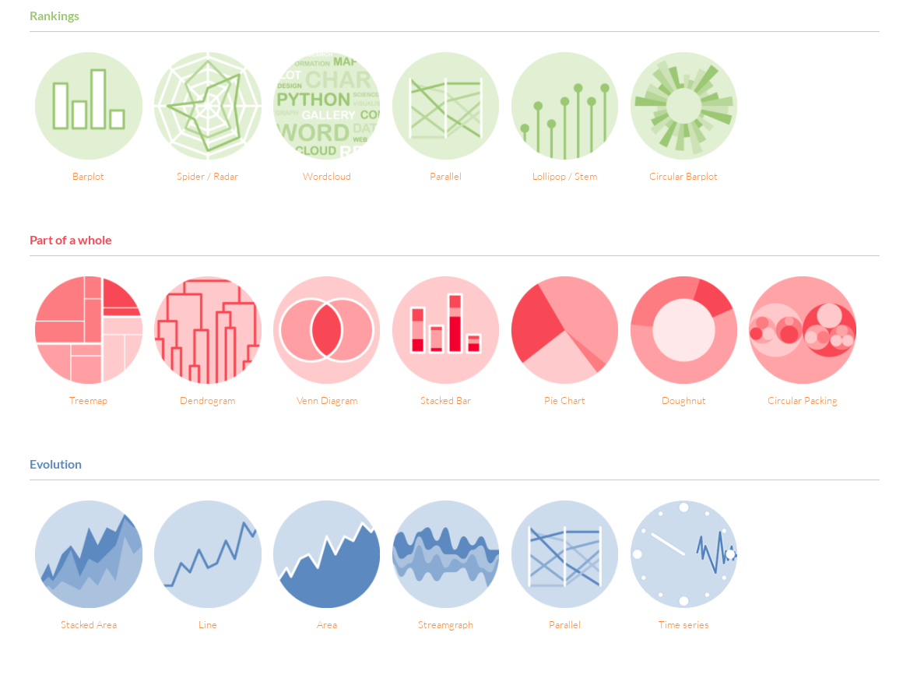
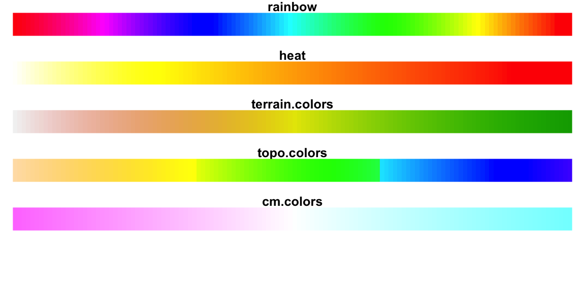

<h1><center>UFJF | FACULDADE DE ECONOMIA | ECONS</center></h1>


<h1><center> LABORATÓRIO DE ESTUDOS ECONÔMICOS </center></h1>

<h1><center>Introdução ao R - ECONS</center></h1>


André Suriane; Stephanie M.P. da Costa.


---

# Sumário

- [1 Introdução](#1-Introdução)
  - [1.1 Instalando o R](#1.1-Instalando-o-R)  
  - [1.2 Interface do R](#1.2-Interface-do-R)  


- [2 Comandos Básicos](#2-Comandos-Básicos)
  - [2.1 Utilizando Ajuda](#2.1-Utilizando-Ajuda)
  - [2.2 Pacotes](#2.2-Pacotes)
  - [2.3 Atribuição de Valores](#2.3-Atribuição-de-Valores)
  - [2.4 Comandos Auxiliares](#2.4-Comandos-Auxiliares)
  - [2.5 Operações matemáticas simples](#2.5-Operações-matemáticas-simples)
  - [2.6 Operações lógicas simples](#2.6-Operações-lógicas-simples)
  - [2.7 Funções matemáticas simples](#2.7-Funções-matemáticas-simples)
  
  
- [3 Objetos básicos](#3-Objetos-básicas)
  - [3.1 Vetores](#3.1-Vetores)
  - [3.2 Arrays](#3.2-Arrays)
  - [3.3 Matrizes](#3.3-Matrizes)
  - [3.4 Listas](#3.4-Listas)
  - [3.5 Data frames](#3.5-Data-frames)
  - [3.6 Funções](#3.6-Funcões)
  
  
- [4 Importação de dados](#4-Importação-de-dados)
  - [4.1 Importando arquivos .csv](#4.1-Importando-arquivos-.csv)
  - [4.2 salvando e abrindo data frame](#4.2-salvando-e-abrindo-data-frame)
  
  
- [5 Tabelas e estatísticas](#5-Tabelas-e-estatísticas)
  - [5.1 Estatísticas descritivas](#5.1-Estatísticas-descritivas)
  - [5.2 Tabelas](#5.2-Tabelas)
  - [5.3 Estatística multivariada](#5.3-Estatística-multivariada)
  - [5.4 Funções e estruturas de controle e repetição](#5.4-Funções-e-estruturas-de-controle-e-repetição)
  - [5.5 Regressão simples](#5.5-Regressão-simples)
  
  
- [6 Gráficos](#6-Gráficos)
  - [6.1 Linhas e pontos](#6.1-Linhas-e-pontos)
  - [6.2 Barras e histogramas](#6.2-Barras-e-histogramas)
  - [6.3 Gráficos para matrizes 2D e 3D](#6.3-Gráficos-para-matrizes-2D-e-3D)


### Antes de começar
Por que usar o R?
- Livre e Gratuito;
- Não serve somente para econometria/estatística;
- Automatizar/repetir procedimentos;
- Similiaridade e associação com outras linguagens de programação;
- Facilidade de divulgar/dividar resultados com outros programas e formatos (LATEX, Shiny, PDF, MarkDown, Jupyter(HTML, GIT, ipynb,doc) ...);
- Quantidade, diversidade e qualidade dos pacotes;
- Tamanho da comunidade;
- Facilidade de encontrar suporte na web;
- Pacotes e funções são atualizados constantemente;
- Mercado de trabalho (grandes empresas estão cada vez mais interessados em prossionais que saibam usar R);
- Te obriga a ter um conhecimento teórico maior;
- Conversa com outros softwares;
- Liberdade na implementação e criação de scripts.

quais são os custos?
- iniciação difícil;
- necessidade de aprofundamento computacional para execução das tarefas;

---

# 1 Introdução


Este curso tem um perfil de introdutório de manipulação, análise e apresentação gráfica de dados.
O objetivo deste curso é capacitar o usuário a visualizar, manipular e analisar dados no R a partir da compreensão da estrutura e funcionamento do software. 
Para isso são apresentados a operacionalização do R e algumas funções básicas, como manipular bancos de dados, melhorar a "aparência" dos dados, modificar e criar variáveis, calcular estatísticas descritivas e criar apresentações gráficas dos dados.


O curso está dividido em duas partes:

na primeira será mostrado a operacionalização do R, com funções e manipulação e definição de objetos. O foco é garantir ao aluno conhecimento que permita ele ingressar no uso do software sem maiores barreiras;
a segunda parte, foca em mostrar elementos básicos da análises estatística e econômica no R.


Para mais informações acesse a página do ECONS (www.ufjf.br/econs/).

[&laquo;](#Sumário)

## 1.1 Instalando o R


O R é um software livre para computação estatística e construção de gráficos que pode ser baixado e distribuído 
gratuitamente de acordo com a licença GPL.
O R está disponível para as plataformas UNIX, Windows e MacOS.


### Windows - Instalação rápida

* baixe a última versão do aplicativo no link, e execute seguindo as observações para instalação.

http://cran-r.c3sl.ufpr.br/bin/windows/base/


##### Interface R no sistema operacional Windows


### Linux - distribuição Ubuntu

* Execute em um terminal

Ubuntu
> `sudo apt-get install r-base r-base-core`

Fedora/RHEL/CENTOS
> `sudo yum install R`

Obs: Entre em http://cran-r.c3sl.ufpr.br/bin/linux e veja as instruções específicas para 
sua distribuição. As distribuições que já possuem pacotes pré-compilados são: Debian(Ubuntu), RedHat(CentOS), Fedora, Suse(OpenSuse). 

##### Interface R no sistema operacional Linux - Ubuntu


[&laquo;](#Sumário)

## 1.2 Interface do R


Fazer dowload no link:
https://www.rstudio.com/products/rstudio/download/

Escolher a ultima versão do RStudio para instalar, lembrando sempre que pode haver versões novas.


##### Interface do RStudio


<a id='index-2'></a>


---

[&laquo;](#Sumário)


# 2 Comandos Básicos


## 2.1 Utilizando Ajuda

O R conta com o comando `help()` para consultar a sintaxe de algum comando ou
obter mais informações sobre determinada função. (Podemos usar também o painel do RStudio).

*Exemplo:*


```R
help(comando) # sintaxe 
help(sqrt)
help("sqrt")   #ajuda sobre o comando de raiz quadrada
?sqrt
help.search("sqrt")
```

Ao executar o exemplo acima no R, uma interface do menu de ajuda será executada
mostrando o tópico da função sqrt, que é função matemática para a raiz quadrada.

*Exemplo da descrição de ajuda para a função sqrt.*


- Para conhecer e tirar dúvidas sobre o R acesse:

 - https://cran.r-project.org/manuals.html

 - https://cran.r-project.org/

[&laquo;](#Sumário)

## 2.2 Pacotes

O R conta com uma infinidade de pacotes permitindo o usuário as mais diversificadas ações.
Para installar um pacote use `install.packages("pkg.name")` ou use o painel do RStudio (Packages/Install).

*Exemplo:*

`install.packages("ggplot2")`

---

**Pacotes úteis**

| Nome | Descrição | 
| :- | -: |
| **Manipulação de dados** |
| [dplyr*](https://www.rdocumentation.org/packages/dplyr) | manipulação de dados |
| [feather](https://www.rdocumentation.org/packages/feather) | Abrir e salvar dados de forma eficiente  |
| [foreign*](https://www.rdocumentation.org/packages/foreign)  |  Importar e exportar bases de/para outros programas  | 
| [haven*](https://www.rdocumentation.org/packages/haven) |  Importar e exportar bases de/para outros programas |
| [DBI](https://www.rdocumentation.org/packages/DBI) |  Conectar com bases de dados | 
| [filehash](https://www.rdocumentation.org/packages/filehash)  | Alocar memoria em HD para grandes bases de dados | 
| [RSQLite](https://www.rdocumentation.org/packages/RSQLite) |  Conectar com bases SQLite (requer DBI) | 
| [**tidyverse**](https://www.tidyverse.org/) | Data science |
| **Gráficos** |
| [ggplot2*](https://www.rdocumentation.org/packages/ggplot2)  | Criar manipular gráficos | 
| [ggfortify*](https://www.rdocumentation.org/packages/ggfortify) | Gráficos para resultados de modelos |
| [ggcorrplot*](https://www.rdocumentation.org/packages/ggcorrplot) |  Gráfico de correlações |
| [grid](https://www.rdocumentation.org/packages/grid) |  Combinar, criar arranjos gráficos | 
| [lattice](https://www.rdocumentation.org/packages/lattice) |  alternativa ao contour plot | 
| [viridis*](https://www.rdocumentation.org/packages/viridis) | Paleta de cores alternativa |
| [plotly](https://www.rdocumentation.org/packages/plotly) | Criar manipular gráficos | 
| **Exportar resultados em LaTeX ou HTML** |
| [Hmisc](https://www.rdocumentation.org/packages/Hmisc) |  Exportar em LATEX ou HTML e outras funções | 
| [xtable](https://www.rdocumentation.org/packages/xtable) |  Exportar em LATEX ou HTML | 
| **Algebra** |
| [Matrix](https://www.rdocumentation.org/packages/Matrix) |  Operações com Matrizes | 
| [Rfast](https://www.rdocumentation.org/packages/Rfast) | Funções eficientes de manipulação algebrica |
| **Estatística** |
| [survival](https://www.rdocumentation.org/packages/survival) | Regressões censuradas | 
| [systemfit](https://www.rdocumentation.org/packages/systemfit) |  Sistema de Equações  | 
| [MASS](https://www.rdocumentation.org/packages/MASS) |  Várias funções estatísticas | 
| [MVar.pt*](https://www.rdocumentation.org/packages/MVar.pt) | Análise multivariada com saídas em português | 
| [nlme](https://www.rdocumentation.org/packages/nlme) |  Efeitos fixos e Aleatórios | 
| [nls2](https://www.rdocumentation.org/packages/nls2) |  Regressões não lineares | 
| [nnet](https://www.rdocumentation.org/packages/nnet) |  Multinomial logit/probit | 
|**Acesso a Dados**|
| [Quandl](https://www.rdocumentation.org/packages/Quandl) | Acesso a dados financeiros e econômicos em geral |
| [quantmod](https://www.rdocumentation.org/packages/quantmod) | Acesso e ferrementas dados financeiros e econômicos em geral |
| [BatchGetSymbols](https://www.rdocumentation.org/packages/BatchGetSymbols) | Acesso a dados financeiros |
| [BETS](https://www.rdocumentation.org/packages/BETS) | Dados macroecônomicos do Brasil |
| [microdadosBrasil](https://www.rdocumentation.org/packages/microdadosBrasil) | Microdados do Brasil  |
| [lodown](http://asdfree.com/) | Microdados produzindos no mundo  |
 

---

*devem ser instaladas para o curso de introdução.

Para ter acesso as funções de pacote deve usar a função:

`library(pacname)` ou `require(pacname)`

Pelo RStudio basta selecionar o pacote pela janela Packages.


[&laquo;](#Sumário)

## 2.3 Atribuição de Valores

Como todo tipo de programação, é comum que tenhamos que atribuir valores para algumas variáveis antes de utilizá-las. No R podemos fazer uma atribuição de valores de várias formas, conforme os exemplos abaixo:


```R
x <- 5 # x recebe o valor 5
x = 19 # x recebe o valor 19
assign ("x", 2i) # x recebe o numero imaginario 2i  
#obs: o ultimo valor que x recebe é o que permanece, neste caso x=19
```

Apesar das diferentes formas de atribuição mostradas acima. Utilizaremos nessa apostila, por uma questão de precedência de operadores, sempre os símbolos `<-` para atribuição de valores.

Para mostrar o valor armazenado em uma variável, basta digitar a variável no Console e apertar Enter. 
Qualquer valor digitado sem atribuição pode ser mostrado na tela.


```R
 x <- 50    # x recebe o valor 50
x/20        # x dividido por 20
```


2.5


```R
x  <- 10:20    # cria uma sequencia de números de 10 a 20
x[1:5]    # mostra os 5 primeiros números da sequencia criada
```


<ol class=list-inline>
	<li>10</li>
	<li>11</li>
	<li>12</li>
	<li>13</li>
	<li>14</li>
</ol>


```R
 y <- sum((10:20)^2)==sum(x^2)
 y
```


TRUE


```R
x <- seq(0, 50, l = 101)               # cria uma sequencia de 0 a 50 com 101 números
y <- 1 - (1/x) * sin(x)                # cria um valor para y
plot(x,y,  type = "l", col = "blue")   # constrói um gráfico com as variáveis x e y na cor azul
```


[&laquo;](#Sumário)
## 2.4 Comandos Auxiliares

Abaixo veremos uma tabela com os principais comandos que ajudam a manipular os
objetos e a "workspace"  que estão sendo utilizados durante a execução do programa.

 


```R
  install.packages() # Instalar pacotes
  library() # Loads packages 
  c() list() # Construir vetor; Listar vetor
  data.frame() # Construir data.frames 
  x:y seq(x,y,...) # Criar vetor entre valores x e y 
  getwd() # Mostrar o diretorio atual 
  setwd() # Definir o diretorio de trabalho 
  dir() # Listar os arquivos no diretorio de trabalho 
  ?  # Buscar ajuda
  read.table() read.csv() read.delim() # Importar dados 
  colnames() # Informar ou aplicar nomes em vetores
  head() tail() # Informar primeiro é ultimo dado em um data.frame 
  summary() aggregate() table(x) addmargins(table(x)) prop.table(table(x), 1:2) # Estimar tabelas estatisticas 
  x[i], x[i, j], x$j # Extrair ou aplicar a elementos de matrizes e data.frames
  plot(y ~ x) hist(y) boxplot(y ~ x) # Gerar graficos 
  na.omit() # omitit missins
```

 **Exemplos:**


```R
#setwd("C:/Rcurso 2020") ## definir pasta de trabalho
getwd()   # mostrar pasta de trabalho
x <- seq(0, 50, l = 101)
y <- 1 - (1/x) * sin(x)
mean(x)       # media de x
mean(y)     # media de y   **vai dar NaN
mean(y, na.rm=TRUE)    # media de y, removendo NaN
```


'/mnt/Disco1/Jupyter/R/Rcurso2019'


25


NaN


0.973985776746886


```R
# remover Na NaN
mean(na.omit(y)) 
sum(y, na.rm = TRUE)
cor(x[2:50], y[2:50])
```


0.973985776746886


97.3985776746886


0.411679957637109


[&laquo;](#Sumário)
## 2.5 Operações matemáticas simples

As operações matemáticas simples que podem ser executadas no R são:
* potenciação (^);
* divisão (/);
* divisão inteira ( % / %) - retorna o quociente inteiro da divisão;
* divisão resto  (%%); - retorna o resto da divisão
* multiplicação  (∗);
* adição  (+);
* subtração (-)

 **Exemplo:**


```R
x = 9.8*(36/10)
x = 40+ x*(40-x)
x
```


206.5216


```R
20 / 3
20 %/% 3  # retorna o quociente inteiro da divisao
20 %% 3  # retorna o resto da divisao
```


6.66666666666667


6


2


```R
x <- 4
y <- 3
x+y; x-y; x*y; x/y; x^y; x**y; x%/%y; x %% y # Operadores aritmeticos
```


7


1


12


1.33333333333333


64


64


1


1


[&laquo;](#Sumário)
## 2.6 Operações lógicas simples

* não (!);
* diferente(!=)
* e (&) 
* ou (|) 
* ou exclusivo (xor(x,y));
* verificando vetor unitário (isTrue(x));
* e (&&) # operacao com vetor;
* ou (||) # operacao com vetor.

**Exemplo:**


```R
1!=2; 1!=1; 1&2<=1; 1&2>0; 1|2!=1; 1|2==1    #TRUE OR FALSE?
cat("verificar variável")
x <- 1
y <- -1
x<y; x>y; x<=y; x>=y; x==y; x!=y;  # Operadores relacionais 
cat("verificar valor em vetor")
x <- 1
Y <- -1:1
x%in%Y 
x>Y

```


TRUE


FALSE


FALSE


TRUE


TRUE


TRUE


    verificar valor


FALSE


TRUE


FALSE


TRUE


FALSE


TRUE


    verificar valor em vetor


TRUE


<ol class=list-inline>
	<li>TRUE</li>
	<li>TRUE</li>
	<li>FALSE</li>
</ol>


```R
x <- c(3,0);    # cria objeto
(2<=x)&(4>=x)   #3 é maior ou igual a 2?  e  4 é maior ou igual a 0? 
(x<=1)|(x==4)
```


<ol class=list-inline>
	<li>TRUE</li>
	<li>FALSE</li>
</ol>


<ol class=list-inline>
	<li>FALSE</li>
	<li>TRUE</li>
</ol>


```R
x <- c(TRUE, TRUE, FALSE, FALSE)
y <- rep(TRUE,4)
z <- rep(FALSE,4)
nx <- c( FALSE, FALSE,TRUE, TRUE)

# Operadores logicos 

cat("___ou___")
x&y; 
x&&y; x&&z;  y&&z; x&&nx;
cat("___e___")
x|y; 
x||y; x||z;  y||z; z||FALSE;
```

    ___ou___


<ol class=list-inline>
	<li>TRUE</li>
	<li>TRUE</li>
	<li>FALSE</li>
	<li>FALSE</li>
</ol>


TRUE


FALSE


FALSE


FALSE


    ___e___


<ol class=list-inline>
	<li>TRUE</li>
	<li>TRUE</li>
	<li>TRUE</li>
	<li>TRUE</li>
</ol>


TRUE


TRUE


TRUE


FALSE


[&laquo;](#Sumário)
## 2.7 Funções matemáticas simples

Algumas chamadas de funções matemáticas simples.
* abs(x) # valor absoluto
* log(x,b) # logaritmo de x com base b
* log(x) # logaritmo natural de x
* log10(x) # logaritmo de x com base 10
* exp(x) # exponencial elevado a x
* sin(x) # seno de x
* cos(x) # cosseno de x
* tan(x) # tangente de x
* round(x, digits = n) # arredonda x com n decimais
* ceiling(x) # arredondamento de x para o maior valor
* floor(x) # arredondamento de x para o menor valor
* length(x) # numero de elementos do vetores
* sum(x) # soma dos elementos do vetor x
* prod(x) # produto dos elementos do vetor x
* max(x) # seleciona o maior elemento do vetor x
* min(x) # seleciona o menor elemento do vetor x
* range(x) # retorna o menor e o maior elemento do vetor x


---
[&laquo;](#Sumário)

# 3 Objetos básicos

O R é orientado a objetos. Os tipos básicos de objetos são: vetores, matrizes, dataframes, listas e funcões. 
Nessa seção aprenderemos um pouco mais sobre essas estruturas de dados e alguns comandos básicos para manipulá-las. É importante salientar que muitas funções são orientadas especificamente a natureza do objeto, assim uma mesma função pode retornar saídas diferentes dependendo da natureza do objeto, mas é mais comum existir funções que são exclusivas a uma natureza específica, levando ao erro caso da função caso a definição do objeto seja diferente da demandada pela função. 

## 3.1 Vetores

Vetores são uma sequências de valores numéricos ou de caracteres(letras, palavras). Sua principal utilidade é poder
armazenar diversos dados em forma de lista e aplicar funções e operações sobre todos os dados pertencentes a 
determinado vetor com apenas poucos comandos.

 *Exemplo:*


```R
  vec1 <- c(1,4,10,13.10,91,15.8) #forma mais simples de declarar um vetor
vec1
```


<ol class=list-inline>
	<li>1</li>
	<li>4</li>
	<li>10</li>
	<li>13.1</li>
	<li>91</li>
	<li>15.8</li>
</ol>


```R
  vec2 <- 1:6 # cria um vetor com uma sequencia de 1 ate 6
vec2
```


<ol class=list-inline>
	<li>1</li>
	<li>2</li>
	<li>3</li>
	<li>4</li>
	<li>5</li>
	<li>6</li>
</ol>


```R
  vec3 <- c((1:3),(3:1))
vec3
```


<ol class=list-inline>
	<li>1</li>
	<li>2</li>
	<li>3</li>
	<li>3</li>
	<li>2</li>
	<li>1</li>
</ol>


```R
  vec4 <- c(0,vec3[1:2], vec3[5:6] , 0)
vec4
```


<ol class=list-inline>
	<li>0</li>
	<li>1</li>
	<li>2</li>
	<li>2</li>
	<li>1</li>
	<li>0</li>
</ol>


```R
  seq(from = 1, to = 8)  # vetor de 1 ate 8
```


<ol class=list-inline>
	<li>1</li>
	<li>2</li>
	<li>3</li>
	<li>4</li>
	<li>5</li>
	<li>6</li>
	<li>7</li>
	<li>8</li>
</ol>


```R
 seq(from = 1 ,to = 15, length.out = 3)   #vetor de 1 ate 15 com 2 elementos 
 seq(from = 1 , to = 15, by = 3)  #vetor de 1 ate 15 com passo 2
```


<ol class=list-inline>
	<li>1</li>
	<li>8</li>
	<li>15</li>
</ol>


<ol class=list-inline>
	<li>1</li>
	<li>4</li>
	<li>7</li>
	<li>10</li>
	<li>13</li>
</ol>


```R
  rep(10, 3)  # repete o elemento 10, dez vezes
  rep(3:4, 2)  #repete a sequência de 3 a 6, três vezes
```


<ol class=list-inline>
	<li>10</li>
	<li>10</li>
	<li>10</li>
</ol>


<ol class=list-inline>
	<li>3</li>
	<li>4</li>
	<li>3</li>
	<li>4</li>
</ol>


[&laquo;](#Sumário)
## 3.2 Arrays

Podemos definir arrays
como um conjunto de elementos de dados, geralmente do
mesmo tamanho e tipo de dados. Elementos individuais são acessados por sua posição
no array. A posição é dada por um índice, também chamado de subscrição. O índice
geralmente utiliza uma sequência de números naturais.  Arrays podem ser de qual-
quer tipo, porém neste capítulo abordaremos apenas arrays numéricos, devido a sua
grande importância para declaração de matrizes. Existem arrays unidimensionais e multi-
dimensionais. Arrays numéricos unidimensionais nada mais são do que vetores, como já
vimos. Já arrays numéricos multidimensionais podem ser usados para representação de
matrizes. 

 *Exemplo:*


```R
# x <- array (dados, dim = vetor_dimensao) #sintaxe
x <- array(c(10:20), dim = c(2,2))
 x
```


<table>
<caption>A matrix: 2 × 2 of type int</caption>
<tbody>
	<tr><td>10</td><td>12</td></tr>
	<tr><td>11</td><td>13</td></tr>
</tbody>
</table>


*Obs: Vetores são arrays de uma dimensão. Já Arrays podem ser definidos com quantas dimensões o usuário desejar.*

[&laquo;](#Sumário)
## 3.3 Matrizes

Matrizes são coleções de vetores em linhas e colunas, todos os vetores devem ser do mesmo tipo (numérico ou de caracteres).


 ```
 x <-matrix(data = dados, nrow = m, ncol = n, byrow = Q) #sintaxe
 ```

 - "m" = numero de linhas,
 - "n" = numero de colunas
 - se Q = 1 #ativa disposicao por linhas
 - se Q = 0, mantem disposicao por colunas
 


```R
 M <- matrix(c(21:28), 2,4 )   # matriz com uma sequencia de 21 a 28, de 2 linhas e 4 colunas
 M 
 M[1,3]                        # retorna o elemento que se encontra na linha 1 e coluna 3
 M[2,1:2]                      # retorna todos os elementos da linha 2

```


<table>
<caption>A matrix: 2 × 4 of type int</caption>
<tbody>
	<tr><td>21</td><td>23</td><td>25</td><td>27</td></tr>
	<tr><td>22</td><td>24</td><td>26</td><td>28</td></tr>
</tbody>
</table>


25


<ol class=list-inline>
	<li>22</li>
	<li>24</li>
</ol>


##### Operações e funções matriciais

Abaixo segue uma tabela com
as principais operações e funções realizadas entre matrizes para algebra linear.

*  A*B # produto elemento a elemento de A e B
*  A%*%B #produto matricial de A por B
*  A %o% B # AB'
*  crossprod(A,B) # t(A)%*%B
*  tcrossprod(A,B) # A%*%t(B) 
*  crossprod(A) # t(A)%*%A
*  A = aperm (A) # matriz transposta
*  A = t(A) # matriz transposta 
*  B = solve(B) #matriz inversa B = B^{-1}
*  x = solve(A,b) #resolve o sistema linear Ax = b
*  det(C) # se C é matrix...retorna o determinante de C
*  **diag(v)** # se v é vetor...retorna uma matriz diagonal onde o vetor v é a diagonal
*  **diag(A)** # se A é matrix...retorna um vetor que é a diagonal da matriz A
*  **diag(n)** # se n é um inteiro, retorna uma matriz identidade de ordem n
*  eigen(A) # retorna os autovalores e autovetores de A
*  svd(A) # Decomposição em valores singulares
*  chol(A) # Decomposição de Choleski 


```R
n = 5
A=matrix(rnorm(n*n, 0, 2) , n , n)
v = c(1:10)
diag(v)
diag(A)
diag(n)
```


<table>
<caption>A matrix: 10 × 10 of type int</caption>
<tbody>
	<tr><td>1</td><td>0</td><td>0</td><td>0</td><td>0</td><td>0</td><td>0</td><td>0</td><td>0</td><td> 0</td></tr>
	<tr><td>0</td><td>2</td><td>0</td><td>0</td><td>0</td><td>0</td><td>0</td><td>0</td><td>0</td><td> 0</td></tr>
	<tr><td>0</td><td>0</td><td>3</td><td>0</td><td>0</td><td>0</td><td>0</td><td>0</td><td>0</td><td> 0</td></tr>
	<tr><td>0</td><td>0</td><td>0</td><td>4</td><td>0</td><td>0</td><td>0</td><td>0</td><td>0</td><td> 0</td></tr>
	<tr><td>0</td><td>0</td><td>0</td><td>0</td><td>5</td><td>0</td><td>0</td><td>0</td><td>0</td><td> 0</td></tr>
	<tr><td>0</td><td>0</td><td>0</td><td>0</td><td>0</td><td>6</td><td>0</td><td>0</td><td>0</td><td> 0</td></tr>
	<tr><td>0</td><td>0</td><td>0</td><td>0</td><td>0</td><td>0</td><td>7</td><td>0</td><td>0</td><td> 0</td></tr>
	<tr><td>0</td><td>0</td><td>0</td><td>0</td><td>0</td><td>0</td><td>0</td><td>8</td><td>0</td><td> 0</td></tr>
	<tr><td>0</td><td>0</td><td>0</td><td>0</td><td>0</td><td>0</td><td>0</td><td>0</td><td>9</td><td> 0</td></tr>
	<tr><td>0</td><td>0</td><td>0</td><td>0</td><td>0</td><td>0</td><td>0</td><td>0</td><td>0</td><td>10</td></tr>
</tbody>
</table>


<ol class=list-inline>
	<li>-0.556391402516848</li>
	<li>-0.383560495293595</li>
	<li>1.08551809710898</li>
	<li>-1.49167923098229</li>
	<li>-0.707581172107287</li>
</ol>


<table>
<caption>A matrix: 5 × 5 of type dbl</caption>
<tbody>
	<tr><td>1</td><td>0</td><td>0</td><td>0</td><td>0</td></tr>
	<tr><td>0</td><td>1</td><td>0</td><td>0</td><td>0</td></tr>
	<tr><td>0</td><td>0</td><td>1</td><td>0</td><td>0</td></tr>
	<tr><td>0</td><td>0</td><td>0</td><td>1</td><td>0</td></tr>
	<tr><td>0</td><td>0</td><td>0</td><td>0</td><td>1</td></tr>
</tbody>
</table>


```R
 M <- matrix(c(1,2,3,5,7,11,13,17), 2,4 )
A <- M%*%t(M)
B <- t(M)%*%M
C <- kronecker(t(M), M) # == t(kronecker(M, t(M)))
D <- replicate(8,"_|_")
D<- cbind(rbind(A, matrix("-",6,2) ),D,rbind(B,matrix("-",4,4)),D,C)
colnames(D)<- c("A1", "A2", "T",  "B1", "B2","B3", "B4","T",  "C1", "C2","C3", "C4", "C5", "C6","C7", "C8" )
D

# rbind() # juntar matrizes verticalmente 
# cbind() # juntar matrizes horizontamente
```


<table>
<caption>A matrix: 8 × 16 of type chr</caption>
<thead>
	<tr><th scope=col>A1</th><th scope=col>A2</th><th scope=col>T</th><th scope=col>B1</th><th scope=col>B2</th><th scope=col>B3</th><th scope=col>B4</th><th scope=col>T</th><th scope=col>C1</th><th scope=col>C2</th><th scope=col>C3</th><th scope=col>C4</th><th scope=col>C5</th><th scope=col>C6</th><th scope=col>C7</th><th scope=col>C8</th></tr>
</thead>
<tbody>
	<tr><td>228</td><td>315</td><td>_|_</td><td>5 </td><td>13 </td><td>29 </td><td>47 </td><td>_|_</td><td>1 </td><td>3 </td><td>7  </td><td>13 </td><td>2 </td><td>6 </td><td>14 </td><td>26 </td></tr>
	<tr><td>315</td><td>439</td><td>_|_</td><td>13</td><td>34 </td><td>76 </td><td>124</td><td>_|_</td><td>2 </td><td>5 </td><td>11 </td><td>17 </td><td>4 </td><td>10</td><td>22 </td><td>34 </td></tr>
	<tr><td>-  </td><td>-  </td><td>_|_</td><td>29</td><td>76 </td><td>170</td><td>278</td><td>_|_</td><td>3 </td><td>9 </td><td>21 </td><td>39 </td><td>5 </td><td>15</td><td>35 </td><td>65 </td></tr>
	<tr><td>-  </td><td>-  </td><td>_|_</td><td>47</td><td>124</td><td>278</td><td>458</td><td>_|_</td><td>6 </td><td>15</td><td>33 </td><td>51 </td><td>10</td><td>25</td><td>55 </td><td>85 </td></tr>
	<tr><td>-  </td><td>-  </td><td>_|_</td><td>- </td><td>-  </td><td>-  </td><td>-  </td><td>_|_</td><td>7 </td><td>21</td><td>49 </td><td>91 </td><td>11</td><td>33</td><td>77 </td><td>143</td></tr>
	<tr><td>-  </td><td>-  </td><td>_|_</td><td>- </td><td>-  </td><td>-  </td><td>-  </td><td>_|_</td><td>14</td><td>35</td><td>77 </td><td>119</td><td>22</td><td>55</td><td>121</td><td>187</td></tr>
	<tr><td>-  </td><td>-  </td><td>_|_</td><td>- </td><td>-  </td><td>-  </td><td>-  </td><td>_|_</td><td>13</td><td>39</td><td>91 </td><td>169</td><td>17</td><td>51</td><td>119</td><td>221</td></tr>
	<tr><td>-  </td><td>-  </td><td>_|_</td><td>- </td><td>-  </td><td>-  </td><td>-  </td><td>_|_</td><td>26</td><td>65</td><td>143</td><td>221</td><td>34</td><td>85</td><td>187</td><td>289</td></tr>
</tbody>
</table>


*Resolver o sistema de equações:*

- x + y      =0
-     y + 4z =1    
-     y + 2z =5
    


```R
b <- array(c(0,1,5), dim = c(3,1))
C <- matrix(c(c(1,1,0),c(0,1,4),c(0:2)),3,3,1)   # 1 linhas 0 colunas (0 é o padrão)
R = solve(C,b)
matrix(c("x","y","z", R) ,3,2)
```


<table>
<tbody>
	<tr><td>x </td><td>-9</td></tr>
	<tr><td>y </td><td>9 </td></tr>
	<tr><td>z </td><td>-2</td></tr>
</tbody>
</table>


* rowSums(a)  - Soma de elementos das linhas da matriz
* colSums(a)  - Soma de elementos das colunas da matriz
* rowMeans(a) - média das linhas
* colMeans(a) - média das colunas


```R
A <- matrix(c(1,2,3,4),2,2)
matrix(c(colMeans(A),
       colSums(A),
       rowSums(A),
       rowMeans(A)), 2,4)
```


<table>
<tbody>
	<tr><td>1.5</td><td>3  </td><td>4  </td><td>2  </td></tr>
	<tr><td>3.5</td><td>7  </td><td>6  </td><td>3  </td></tr>
</tbody>
</table>


```R
B <- D[,c(9,13,10,14,11)]
class(B) <- "numeric"
B <- B[B[,1]<10,]
B[1,4] <- B[2,3] 
B[4,1] <- B[3,2] 
B
```


<table>
<caption>A matrix: 5 × 5 of type dbl</caption>
<thead>
	<tr><th scope=col>C1</th><th scope=col>C5</th><th scope=col>C2</th><th scope=col>C6</th><th scope=col>C3</th></tr>
</thead>
<tbody>
	<tr><td>1</td><td> 2</td><td> 3</td><td> 5</td><td> 7</td></tr>
	<tr><td>2</td><td> 4</td><td> 5</td><td>10</td><td>11</td></tr>
	<tr><td>3</td><td> 5</td><td> 9</td><td>15</td><td>21</td></tr>
	<tr><td>5</td><td>10</td><td>15</td><td>25</td><td>33</td></tr>
	<tr><td>7</td><td>11</td><td>21</td><td>33</td><td>49</td></tr>
</tbody>
</table>


```R
det(B)
round(solve(B),5)
```


4


<table>
<caption>A matrix: 5 × 5 of type dbl</caption>
<tbody>
	<tr><th scope=row>C1</th><td>-1.0</td><td> 3</td><td>-5.5</td><td>-1.0</td><td> 2.5</td></tr>
	<tr><th scope=row>C5</th><td> 3.0</td><td> 0</td><td>-1.0</td><td> 0.0</td><td> 0.0</td></tr>
	<tr><th scope=row>C2</th><td>-5.5</td><td>-1</td><td> 0.0</td><td> 1.5</td><td> 0.0</td></tr>
	<tr><th scope=row>C6</th><td>-1.0</td><td> 0</td><td> 1.5</td><td> 0.0</td><td>-0.5</td></tr>
	<tr><th scope=row>C3</th><td> 2.5</td><td> 0</td><td> 0.0</td><td>-0.5</td><td> 0.0</td></tr>
</tbody>
</table>


## 3.4 Listas

Listas são conjuntos de objetos de "qualquer" natureza no R, como vetores, data frames, matrizes, scalares ou até mesmo listas. Não precisam ter
o mesmo tamanho ou a mesma natureza. 


```R
a = list(A = 1, "b", 34, c(1,2,3,4), f = function(x){x^2})
a$f(2)
a
```


4


<dl>
	<dt>$A</dt>
		<dd>1</dd>
	<dt>[[2]]</dt>
		<dd>'b'</dd>
	<dt>[[3]]</dt>
		<dd>34</dd>
	<dt>[[4]]</dt>
		<dd><ol class=list-inline>
	<li>1</li>
	<li>2</li>
	<li>3</li>
	<li>4</li>
</ol>
</dd>
	<dt>$f</dt>
		<dd><pre class=language-r><code>function (x) 
{
<span style=white-space:pre-wrap>    x^2</span>
}</code></pre></dd>
</dl>


[&laquo;](#Sumário)
## 3.5 Data frames

Data frames também são coleções de vetores, mas aceitam vetores de tipos diferentes (numéricos e caracteres). Normalmente,
guardamos dados em objetos do tipo data frame, pois sempre temos variáveis numéricas e variáveis categóricas, por exemplo, nome do aluno 
e idade do aluno, respectivamente. Desse modo, essa estrutura proporciona mais liberdade para manipulação de dados.

Com a função data.frame reunimos vetores de mesmo comprimento em um só objeto: 

`dataframe <- data.frame() #sintaxe`

*Exemplo: *


```R
df <- data.frame (ipca = c(6.62, 4.61,6.03,5.28, 5.70),
                selic = c(1.46, 1.15, 1.16, 1.21, 1.24))
df[1:2,]
```


<table>
<caption>A data.frame: 2 × 2</caption>
<thead>
	<tr><th scope=col>ipca</th><th scope=col>selic</th></tr>
	<tr><th scope=col>&lt;dbl&gt;</th><th scope=col>&lt;dbl&gt;</th></tr>
</thead>
<tbody>
	<tr><td>6.62</td><td>1.46</td></tr>
	<tr><td>4.61</td><td>1.15</td></tr>
</tbody>
</table>


Transformando outros objetos em um data.frame com a função as.data.frame()


```R
ipca <-c(6.62,4.61,6.03,5.28, 5.70)           # cria objeto
selic <- c(1.46,1.15,1.16,1.21,1.24)
nivel_emprego <- c(159.1473,158.0703,156.1412,152.7011,150.9488)
df2 <-data.frame (ipca ,selic , nivel_emprego )   #criando data.frame com os objetos dados
df2[1:3,]      # mostra data.frame com as linhas de 1 a 3
```


<table>
<caption>A data.frame: 3 × 3</caption>
<thead>
	<tr><th scope=col>ipca</th><th scope=col>selic</th><th scope=col>nivel_emprego</th></tr>
	<tr><th scope=col>&lt;dbl&gt;</th><th scope=col>&lt;dbl&gt;</th><th scope=col>&lt;dbl&gt;</th></tr>
</thead>
<tbody>
	<tr><td>6.62</td><td>1.46</td><td>159.1473</td></tr>
	<tr><td>4.61</td><td>1.15</td><td>158.0703</td></tr>
	<tr><td>6.03</td><td>1.16</td><td>156.1412</td></tr>
</tbody>
</table>


O data.frame sempre terá rownames e colnames.


```R
rownames(df2)
names(df2)
colnames(df2)<- c("ipca" , "selic", "ne")
colnames(df2)
```


<ol class=list-inline>
	<li>'1'</li>
	<li>'2'</li>
	<li>'3'</li>
	<li>'4'</li>
	<li>'5'</li>
</ol>


<ol class=list-inline>
	<li>'ipca'</li>
	<li>'selic'</li>
	<li>'nivel_emprego'</li>
</ol>


<ol class=list-inline>
	<li>'ipca'</li>
	<li>'selic'</li>
	<li>'ne'</li>
</ol>


#### Ordenado data.frame


```R
newdf <-df2[ order ( selic ) ,] # ordenando todo o data.frame segundo a variavel selic em ordem crescente
newdf
```


<table>
<thead><tr><th></th><th scope=col>ipca</th><th scope=col>selic</th><th scope=col>ne</th></tr></thead>
<tbody>
	<tr><th scope=row>2</th><td>4.61    </td><td>1.15    </td><td>158.0703</td></tr>
	<tr><th scope=row>3</th><td>6.03    </td><td>1.16    </td><td>156.1412</td></tr>
	<tr><th scope=row>4</th><td>5.28    </td><td>1.21    </td><td>152.7011</td></tr>
	<tr><th scope=row>5</th><td>5.70    </td><td>1.24    </td><td>150.9488</td></tr>
	<tr><th scope=row>1</th><td>6.62    </td><td>1.46    </td><td>159.1473</td></tr>
</tbody>
</table>


```R
newdf2 <-df2[ order (ipca ,selic ),]
newdf2
```


<table>
<thead><tr><th></th><th scope=col>ipca</th><th scope=col>selic</th><th scope=col>ne</th></tr></thead>
<tbody>
	<tr><th scope=row>2</th><td>4.61    </td><td>1.15    </td><td>158.0703</td></tr>
	<tr><th scope=row>4</th><td>5.28    </td><td>1.21    </td><td>152.7011</td></tr>
	<tr><th scope=row>5</th><td>5.70    </td><td>1.24    </td><td>150.9488</td></tr>
	<tr><th scope=row>3</th><td>6.03    </td><td>1.16    </td><td>156.1412</td></tr>
	<tr><th scope=row>1</th><td>6.62    </td><td>1.46    </td><td>159.1473</td></tr>
</tbody>
</table>


```R
df2[ order (-ipca , selic ) ,]
```


<table>
<thead><tr><th></th><th scope=col>ipca</th><th scope=col>selic</th><th scope=col>ne</th></tr></thead>
<tbody>
	<tr><th scope=row>1</th><td>6.62    </td><td>1.46    </td><td>159.1473</td></tr>
	<tr><th scope=row>3</th><td>6.03    </td><td>1.16    </td><td>156.1412</td></tr>
	<tr><th scope=row>5</th><td>5.70    </td><td>1.24    </td><td>150.9488</td></tr>
	<tr><th scope=row>4</th><td>5.28    </td><td>1.21    </td><td>152.7011</td></tr>
	<tr><th scope=row>2</th><td>4.61    </td><td>1.15    </td><td>158.0703</td></tr>
</tbody>
</table>


Para remoção de uma coluna no dataframe basta atribuir NULL a coluna
desejada.

*Exemplo:*


```R
df$selr <- df$selic+df$ipca
df$ipca <-NULL
df
```


<table>
<caption>A data.frame: 5 × 2</caption>
<thead>
	<tr><th scope=col>selic</th><th scope=col>selr</th></tr>
	<tr><th scope=col>&lt;dbl&gt;</th><th scope=col>&lt;dbl&gt;</th></tr>
</thead>
<tbody>
	<tr><td>1.46</td><td>8.08</td></tr>
	<tr><td>1.15</td><td>5.76</td></tr>
	<tr><td>1.16</td><td>7.19</td></tr>
	<tr><td>1.21</td><td>6.49</td></tr>
	<tr><td>1.24</td><td>6.94</td></tr>
</tbody>
</table>


#### Fazer operações e agregar data frames por variáveis de grupo


```R
datacsv <- read.csv2("Exemplo/Exemplo1_ipca.csv",header =T, sep=";", dec=".")
ipca <- datacsv
colnames(ipca)<- c("data", "ipca12")
ipca$ano <- floor(ipca[,1])
ipca$min <- ave(ipca$ipca12, ipca$ano, FUN = min)
ipca$max <- ave(ipca$ipca12, ipca$ano, FUN = max)
ipca$mean <- ave(ipca$ipca12, ipca$ano, FUN = mean)

ipca2 <- aggregate(x = ipca,
              by = list(ipca$ano),
              FUN = mean)
ipca2[1:5,];
ipca[1:5,]
```


<table>
<caption>A data.frame: 5 × 7</caption>
<thead>
	<tr><th scope=col>Group.1</th><th scope=col>data</th><th scope=col>ipca12</th><th scope=col>ano</th><th scope=col>min</th><th scope=col>max</th><th scope=col>mean</th></tr>
	<tr><th scope=col>&lt;dbl&gt;</th><th scope=col>&lt;dbl&gt;</th><th scope=col>&lt;dbl&gt;</th><th scope=col>&lt;dbl&gt;</th><th scope=col>&lt;dbl&gt;</th><th scope=col>&lt;dbl&gt;</th><th scope=col>&lt;dbl&gt;</th></tr>
</thead>
<tbody>
	<tr><td>1980</td><td>1980.065</td><td> 5.922500</td><td>1980</td><td>4.23</td><td> 9.48</td><td> 5.922500</td></tr>
	<tr><td>1981</td><td>1981.065</td><td> 5.754167</td><td>1981</td><td>4.97</td><td> 6.84</td><td> 5.754167</td></tr>
	<tr><td>1982</td><td>1982.065</td><td> 6.160000</td><td>1982</td><td>4.44</td><td> 7.81</td><td> 6.160000</td></tr>
	<tr><td>1983</td><td>1983.065</td><td> 8.433333</td><td>1983</td><td>6.48</td><td>10.30</td><td> 8.433333</td></tr>
	<tr><td>1984</td><td>1984.065</td><td>10.045833</td><td>1984</td><td>8.94</td><td>11.98</td><td>10.045833</td></tr>
</tbody>
</table>


<table>
<caption>A data.frame: 5 × 6</caption>
<thead>
	<tr><th scope=col>data</th><th scope=col>ipca12</th><th scope=col>ano</th><th scope=col>min</th><th scope=col>max</th><th scope=col>mean</th></tr>
	<tr><th scope=col>&lt;dbl&gt;</th><th scope=col>&lt;dbl&gt;</th><th scope=col>&lt;dbl&gt;</th><th scope=col>&lt;dbl&gt;</th><th scope=col>&lt;dbl&gt;</th><th scope=col>&lt;dbl&gt;</th></tr>
</thead>
<tbody>
	<tr><td>1980.01</td><td>6.62</td><td>1980</td><td>4.23</td><td>9.48</td><td>5.9225</td></tr>
	<tr><td>1980.02</td><td>4.62</td><td>1980</td><td>4.23</td><td>9.48</td><td>5.9225</td></tr>
	<tr><td>1980.03</td><td>6.04</td><td>1980</td><td>4.23</td><td>9.48</td><td>5.9225</td></tr>
	<tr><td>1980.04</td><td>5.29</td><td>1980</td><td>4.23</td><td>9.48</td><td>5.9225</td></tr>
	<tr><td>1980.05</td><td>5.70</td><td>1980</td><td>4.23</td><td>9.48</td><td>5.9225</td></tr>
</tbody>
</table>


**Outras funções:**

* names() #  retorna os nomes das colunas
* with() # permite operacoes nas colunas sem repetir o nome do data.frame seguido de "$" , [ , ] ou [[]].
* sapply()# aplica uma determinada funcao nas colunas de um data.frame
* lapply() # aplica uma determinada funcao nas colunas de um data.frame , retornando uma lista
* filter() # permite filtrar apenas colunas de uma determinada classe ou referente a alguma condicao
* attach() # anexa ao conjunto de dados , de modo a poder chamar colunas diretamente
* cumsum() # a soma cumulativa de todas as entradas tomadas coluna a coluna .
* cumprod() # o produro cumulativo de todas as entradas tomadas coluna a coluna
* cummin() # retorna um vetor onde o n- esimo elemento eh o minimo de x[1] ate x[i]
* cummax() # retorna um vetor onde o n- esimo elemento eh o maximo de x[1] ate x[i]
* saveRDS() # salvar um data.frame comprimindo os dados (pode levar tempo no caso de grandes bases)
* agregate() # agregar dados segunda variavel de grupo
* subset() # selecionar partes do data frame
* merge() # juntar dois dataframes por meio de controle de codigos ou nomes de colunas ou linhas


```R
df <- data.frame(casa = c(1:100),
                 festa = seq(0,1,l = 100),
                 util = rnorm(100),
                 dy = round(seq(0,1,l = 100),0)
                )
tail(df)

# dividir data frame
a <- split(df$util,df$dy)
summary(a)

#Aplicar e combinar
lapply(a,mean)

#Aplicando e simplificando
sapply(a, mean)
vapply(a, mean, numeric(1))

# Dividir, Aplicar e Combinar junto
tapply(df$util, df$dy, mean)

aggregate(df$util, by=list(df$dy), mean)

aggregate(util~dy,df, mean)

```


<table>
<caption>A data.frame: 6 × 4</caption>
<thead>
	<tr><th></th><th scope=col>casa</th><th scope=col>festa</th><th scope=col>util</th><th scope=col>dy</th></tr>
	<tr><th></th><th scope=col>&lt;int&gt;</th><th scope=col>&lt;dbl&gt;</th><th scope=col>&lt;dbl&gt;</th><th scope=col>&lt;dbl&gt;</th></tr>
</thead>
<tbody>
	<tr><th scope=row>95</th><td> 95</td><td>0.9494949</td><td> 0.07795494</td><td>1</td></tr>
	<tr><th scope=row>96</th><td> 96</td><td>0.9595960</td><td> 0.19761618</td><td>1</td></tr>
	<tr><th scope=row>97</th><td> 97</td><td>0.9696970</td><td> 2.24655626</td><td>1</td></tr>
	<tr><th scope=row>98</th><td> 98</td><td>0.9797980</td><td>-0.42806242</td><td>1</td></tr>
	<tr><th scope=row>99</th><td> 99</td><td>0.9898990</td><td> 0.23300655</td><td>1</td></tr>
	<tr><th scope=row>100</th><td>100</td><td>1.0000000</td><td> 0.71609882</td><td>1</td></tr>
</tbody>
</table>


      Length Class  Mode   
    0 50     -none- numeric
    1 50     -none- numeric


<dl>
	<dt>$`0`</dt>
		<dd>-0.141514710431814</dd>
	<dt>$`1`</dt>
		<dd>-0.0476781146322781</dd>
</dl>


<dl class=dl-horizontal>
	<dt>0</dt>
		<dd>-0.141514710431814</dd>
	<dt>1</dt>
		<dd>-0.0476781146322781</dd>
</dl>


<dl class=dl-horizontal>
	<dt>0</dt>
		<dd>-0.141514710431814</dd>
	<dt>1</dt>
		<dd>-0.0476781146322781</dd>
</dl>


<dl class=dl-horizontal>
	<dt>0</dt>
		<dd>-0.141514710431814</dd>
	<dt>1</dt>
		<dd>-0.0476781146322781</dd>
</dl>


<table>
<caption>A data.frame: 2 × 2</caption>
<thead>
	<tr><th scope=col>Group.1</th><th scope=col>x</th></tr>
	<tr><th scope=col>&lt;dbl&gt;</th><th scope=col>&lt;dbl&gt;</th></tr>
</thead>
<tbody>
	<tr><td>0</td><td>-0.14151471</td></tr>
	<tr><td>1</td><td>-0.04767811</td></tr>
</tbody>
</table>


<table>
<caption>A data.frame: 2 × 2</caption>
<thead>
	<tr><th scope=col>dy</th><th scope=col>util</th></tr>
	<tr><th scope=col>&lt;dbl&gt;</th><th scope=col>&lt;dbl&gt;</th></tr>
</thead>
<tbody>
	<tr><td>0</td><td>-0.14151471</td></tr>
	<tr><td>1</td><td>-0.04767811</td></tr>
</tbody>
</table>


```R
e <- 5e3
x <- matrix(rnorm(e*e),e*e,1)
b <-data.frame(x)
hypot <- function(x) sqrt(x^2+x^2)
system.time({a1 <- apply(x, 2, var)})
system.time({a1 <- with(b, var(x))})
system.time({a1 <- Rfast::colVars(x)})
```


       user  system elapsed 
      0.263   0.033   0.295 


       user  system elapsed 
      0.057   0.013   0.070 


       user  system elapsed 
      0.129   0.000   0.129 


---
[&laquo;](#Sumário)

# 4 Importação de dados


Se os dados estiverem salvos em arquivos, sob forma de planilhas, tabelas, etc., deve-
se fazer com que o R leia estes arquivos, transformando-os em um objeto. 
Para que o R
reconheça o conjunto de dados do arquivo é necessário que as colunas sejam separadas.
Caso isso não ocorra o R não conseguirá separar as colunas e emitirá uma mensagem
de erro.
Um modo fácil de resolver este problema é salvar a planilha de dados com o
formato (.csv) que utiliza virgula (,) como elemento separador das colunas.
Porém, antes de iniciar a entrada de dados no R deve-se alterar a pasta de trabalho
padrão em que o arquivo de dados .csv será salvo.
Para isso basta ir em :Arquivo/Mudar
dir...
e alterar o diretório em que será salvo o arquivo. 
Ao abrir a página de alteração do diretório, escolha o diretório em que será salvo o arquivo.
Depois de salvar o arquivo no diretório especificado, carregue o arquivo no console do R.


Outra maneira de alterar o diretório é utilizar o seguinte comando, especificando,
como argumento, o diretório requerido:

`setwd('C:/Rdados') # copie o endereço do diretório, `
` # mas não esquece de trocar as barras \ -> /`

Conferindo o diretório atualizado através do comando:

`getwd ()`

[&laquo;](#Sumário)
## 4.1 Importando arquivos .csv


De posse da pasta de trabalho e do arquivo no formato .csv na pasta Rdados, procederemos com o seguinte comando:

`dir ()`

Com este comando o R irá verificar se há algum arquivo na pasta de trabalho. Como previamente havíamos salvo um arquivo .csv, sabemos que o R  irá encontrar este arquivo no diretório especificado anteriormente.

O primeiro consiste no arquivo "exemplo1.csv". Importaremos o exemplo1.csv, disponível na página do curso. Observe o conteúdo do arquivo e veja que ele est´a separado por vírgulas, como e típico em arquivos desse tipo. Para
fazer a importação, usaremos a função read.csv2. Em seguida, devemos dar o comando para que o R carregue o arquivo .csv no console de trabalho. Para isso digite o seguinte comando:


```R
datacsv <- read.csv2("Exemplo/Exemplo1_ipca.csv",header =T, sep=";", dec=".")
#
#datacsv <- read.table("~/Jupyter/Rcurso/Exemplo/Exemplo1_ipca.csv",header =T, sep=";" ,dec=",")
```


```R
datacsv[1:5,]
```


<table>
<thead><tr><th scope=col>data</th><th scope=col>inflação_ipca.</th></tr></thead>
<tbody>
	<tr><td>1980.01</td><td>6.62   </td></tr>
	<tr><td>1980.02</td><td>4.62   </td></tr>
	<tr><td>1980.03</td><td>6.04   </td></tr>
	<tr><td>1980.04</td><td>5.29   </td></tr>
	<tr><td>1980.05</td><td>5.70   </td></tr>
</tbody>
</table>


**Sendo:**

- datacsv: é o objeto no qual os dados lidos serão reconhecidos pelo R;
- read.csv2 : função que lê o arquivo do tipo.csv. 
- read.table: função que também lê arquivos do tipo.csv, mas organiza os dados em formato de tabela.


O parâmetro "header"  nos permite indicar se o arquivo de dados (data.frame) tem ou não o nome nas colunas (título) na primeira linha de dados. O segundo parâmetro "sep" permite indicar o tipo de separador dos dados presentes no arquivo. Neste caso, o separador "," indica que a delimitação do campo de cada dado será feita por vírgulas.
Finalmente o parâmetro "dec" permite indicar o caractere usado como separador de casas decimais dos números reais.

**Observação:**

existem outras sintaxes para carregar dados no console do R (verifique isso utilizando o comando “help(read.table)”), porém os argumentos permanecem idênticos aos apresentados anteriormente.

Caso o arquivo tenha título, podemos verificar o nome destes títulos através do comando:

`names() # no argumento vai sempre o nome do objeto desejado`

Podemos ver a dimensão do arquivo carregado por meio do seguinte comando:

`dim()`

`head () # retorna a primeira parte de um vetor , matriz , tabela , data frame ou funcao.'


```R
names(datacsv);
dim(datacsv);
head( datacsv , 5) # igual datacsv[1:5 ,] 
```


<ol class=list-inline>
	<li>'data'</li>
	<li>'inflação_ipca.'</li>
</ol>


<ol class=list-inline>
	<li>458</li>
	<li>2</li>
</ol>


<table>
<thead><tr><th scope=col>data</th><th scope=col>inflação_ipca.</th></tr></thead>
<tbody>
	<tr><td>1980.01</td><td>6.62   </td></tr>
	<tr><td>1980.02</td><td>4.62   </td></tr>
	<tr><td>1980.03</td><td>6.04   </td></tr>
	<tr><td>1980.04</td><td>5.29   </td></tr>
	<tr><td>1980.05</td><td>5.70   </td></tr>
</tbody>
</table>


Isto porque o R, agora, considera o arquivo carregado como uma matriz ou data.frame.
Desta forma, podemos localizar linhas, colunas e elementos desta matriz. Para
isso, utilize os comandos abaixo: `datacsv[1:5,]` , `datacsv[1,1]`.

Para desenvolver um exemplo com um arquivo .txt seguimos os seguintes passos:

dir() # verifica a presenca de arquivos no diretorio de trabalho


```R
 datatxt <- read.table('Exemplo/arquivoteste.txt',header=T, sep = ",", dec=".")
 datatxt[1:3,]
```


<table>
<thead><tr><th scope=col>DATA</th><th scope=col>Inflação_IPCA</th><th scope=col>SELIC</th><th scope=col>DESEMPREGO</th></tr></thead>
<tbody>
	<tr><td>1980.01 </td><td>6.615649</td><td>1.46    </td><td>159.1473</td></tr>
	<tr><td>1980.02 </td><td>4.616919</td><td>1.15    </td><td>158.0703</td></tr>
	<tr><td>1980.03 </td><td>6.038389</td><td>1.16    </td><td>156.1412</td></tr>
</tbody>
</table>


Podemos ainda carregar um arquivo de qualquer diretório basta apenas informar este diretório no comando. Para isso, basta utilizar a sintaxe abaixo:

`datatxt <- read.table('/mnt/Disco1/Jupyter/Rcurso/Exemplo/arquivoteste.txt',header=T, sep = ",", dec=".")`

Vamos agora realizar um recorte no conjunto de dados. Para isso vamos usar a função subset e selecionar somente as taxas entre 2000 e 2001 para fins de comparação mais adiante.


```R
ipca <- read.csv2("/mnt/Disco1/Jupyter/Rcurso/Exemplo/Exemplo1_ipca.csv", header = T, sep = ";", dec = ".")
```


```R
ipca <- subset(ipca, data >= 2000 & data <=2015   )
colnames(ipca) <- c("data", "ipca")
data.frame(c(ipca[1:5,],datacsv[1:5,]   ))
```


<table>
<thead><tr><th scope=col>data</th><th scope=col>ipca</th><th scope=col>data.1</th><th scope=col>inflação_ipca.</th></tr></thead>
<tbody>
	<tr><td>2000.01</td><td>0.62   </td><td>1980.01</td><td>6.62   </td></tr>
	<tr><td>2000.02</td><td>0.13   </td><td>1980.02</td><td>4.62   </td></tr>
	<tr><td>2000.03</td><td>0.22   </td><td>1980.03</td><td>6.04   </td></tr>
	<tr><td>2000.04</td><td>0.42   </td><td>1980.04</td><td>5.29   </td></tr>
	<tr><td>2000.05</td><td>0.01   </td><td>1980.05</td><td>5.70   </td></tr>
</tbody>
</table>


```R
selic <- read.csv2 ("Exemplo/Exemplo2_selic.csv", header = T, sep = ",", dec = ".")
selic<- subset(selic, data >=2000 & data <=2015 )
nivel_emprego <- read.csv2 ("Exemplo/Exemplo3_nivelemprego.csv", header = T, sep = ";", dec = ".")
nivel_emprego <- subset(nivel_emprego, data >=2000 & data <=2015 )
dados <- data.frame (selic , ipca , nivel_emprego)
```

[&laquo;](#Sumário)
## 4.2 salvando e abrindo data frame

Salvando os dados em um arquivo.txt via `write.table()` e arquivo csv via a função `write.csv()`.
contudo é possivel salvar um arquivo csv usando `write.table()` ou o contrário.


```R
write.table(dados, "Exemplo/dados.csv", sep = ";")
write.csv(dados, "Exemplo/dados.txt")
```


    Error in is.data.frame(x): objeto 'dados' não encontrado
    Traceback:


    1. write.table(dados, "Exemplo/dados.csv", sep = ";")

    2. is.data.frame(x)


```R
x <- runif(1000000)
x[sample(1000000, 900000)] <- NA # 10% NAs
df3 <- as.data.frame(replicate(100, x))
a <- dim(df3)

```


```R
 save(df3, file = "Exemplo/EXEsave.Rdata") # save.image() salva todo espaço de trabalho
 saveRDS(df3, "Exemplo/EXEsave.RDS")
 write.csv(df3, 'Exemplo/EXEsave.csv') # write.csv2 write.table
 feather::write_feather(df3, 'Exemplo/EXEsave.feather') # eficente python-R data
 foreign::write.dta(df3, 'Exemplo/EXEsave.dta') # Stata V<=13
 haven::write_dta(df3, 'Exemplo/EXEsave2.dta') # Stata V>=14 (le versões anteriores com erro em acentos)
```


```R
 load("Exemplo/EXEsave.Rdata")
 readRDS("Exemplo/EXEsave.RDS")
 read.csv('Exemplo/EXEsave.csv') # read.csv2 read.table
 feather::read_feather('Exemplo/EXEsave.feather')
 foreign::read.dta('Exemplo/EXEsave.dta')
 haven::read.dta('Exemplo/EXEsave.dta')
```

| formato |user | system | elapsed | size | N | K |
| :-  |      -: | -:     | -: | -: | -: |  -: |
| Feather| 	0.736| 	0.932	| 5.630	| 774.86774	| 1e+06	| 100| 
| Stata13| 	4.888| 	1.011| 	10.967	| 762.95501	| 1e+06| 	100| 
| Stata14| 	11.385| 	1.279| 	18.160	| 763.00102	| 1e+06	| 100| 
| RDS| 	12.107| 	0.113	| 12.700	| 74.03126	| 1e+06	| 100| 
| Rdata| 	12.288| 	0.111| 	12.907	| 74.03125	| 1e+06	| 100| 
| CSV| 	36.440| 	0.734| 	42.128	| 437.62616	| 1e+06	| 100| 


| formato |user | system | elapsed | size | N | K |
| :-  |      -: | -:     | -: | -: | -: |  -: |
| Feather| 	0.878| 	0.218| 	1.122	| 774.86774	| 1e+06	| 100| 
| RDS| 	2.073	| 0.024	| 2.097	| 74.03126	| 1e+06	| 100| 
| Rdata| 	2.124| 	0.186	| 2.311	| 74.03125| 	1e+06	| 100| 
| Stata13| 	3.163| 	0.310	| 3.473	| 762.95501	| 1e+06| 	100| 
| Stata14| 	12.713	| 0.397| 	13.238	| 763.00102	| 1e+06	| 100| 
| CSV| 	17.664 | 0.397| 	18.060| 	437.62616| 	1e+06	| 100| 


---
[&laquo;](#Sumário)

# 5 Tabelas e estatísticas

   ## 5.1 Estatísticas descritivas
   
   - Média: A média aritmética é igual ao quociente entre a soma dos valores do conjunto e o número total dos valores.
   - Mediana e quartil: A mediana e quartil são medidas de posição segundo uma ordem (geralmente crescente).
   - Moda: É o valor que ocorre com maior frequência no conjunto de dados
   - Máximo e Minimo: Para calcular amplitudes, máxima e mínima é preciso usar as funções max() e min().
   - Variância e desvio padrão:medidas de dispersão calculadas a partir do desvio da média.
   


```R
v <-c(1 ,2 ,1 ,2 ,2 ,3 ,2)     # cria objeto
x <- c (8 ,16 ,15 ,2 ,19 ,28 ,89 ,50 ,91)
y <- c (2 ,8 ,19 ,15 ,15 ,15 ,89 ,91)
z <- c(5 ,3 ,15 ,0 ,3 ,8 ,1 ,19 ,50)
```


```R
mean(x) # retorna a media 
median(z) # retorna a mediada
```


35.3333333333333


5


```R
quantile(x)
```


<dl class=dl-horizontal>
	<dt>0%</dt>
		<dd>2</dd>
	<dt>25%</dt>
		<dd>15</dd>
	<dt>50%</dt>
		<dd>19</dd>
	<dt>75%</dt>
		<dd>50</dd>
	<dt>100%</dt>
		<dd>91</dd>
</dl>


```R
max(y) # retorna  o maior valor do conjunto
min(y) # retona o menor valor do conjunto
range(z) 
```


91


2


<ol class=list-inline>
	<li>0</li>
	<li>50</li>
</ol>


```R
max(y)-min(y)
diff(range(z))
```


89


50


```R
var(v)    # variancia
sd(v)     # desvio-padrão
```


0.476190476190476


0.690065559342354


```R
summary(z)
```


       Min. 1st Qu.  Median    Mean 3rd Qu.    Max. 
       0.00    3.00    5.00   11.56   15.00   50.00 


[&laquo;](#Sumário)
## 5.2 Tabelas

Tabelas são uma forma resumida de apresentar estatisticas ou caracteristicas dos dados. O objetivo é apresentar os dados e podem ser muito úteis em análises econômicas.

As tabelas são feitas de acordo com a natureza da variável.
Para variáveis discretas são comuns tabelas de frequencia e percentagem.
Para variáveis contínuas são mais comuns tabelas de estatísticas com medidas de tendência central ou de disperção dos dados.

 ### Tabelas de variáveis discretas


```R
#library("haven") # read_dta() stata <=13
library("foreign") # read.dta() stata>=14
  pnad <-  read.dta('Exemplo/pnad_mod.dta')
table(pnad$raca)
```


    
    Ind\xedgena      Branca       Preta     Amarela       Parda         n/d 
              0        1747         313           0        1824           0 


```R
table(pnad$sexo)
table(pnad$sexo, pnad$raca)
```


    
     Homem Mulher 
      1897   1987 


            
             Ind\xedgena Branca Preta Amarela Parda n/d
      Homem            0    824   163       0   910   0
      Mulher           0    923   150       0   914   0


```R
table(pnad$sexo, pnad$raca, exclude=c("Amarela", "n/d", "Ind\xedgena"))
```


            
             Branca Preta Parda
      Homem     824   163   910
      Mulher    923   150   914


```R
pnad$raca <- droplevels(pnad$raca) # deletar levels em que não exite informação
```


```R
attach(pnad) # comando para referenciar variaveis do dataframe diretamente
#detach(pnad, pos = 1) # retirar data frame de referencia pode ter mais de um data.frame em referencia a pos a ordem deles
```


```R
prop.table(table(sexo, raca),1)
```


            raca
    sexo         Branca      Preta      Parda
      Homem  0.43437006 0.08592514 0.47970480
      Mulher 0.46451938 0.07549069 0.45998993


```R
prop.table(table(sexo, raca),2)
prop.table(table(sexo, raca),1)
prop.table(table(sexo, raca))
```


            raca
    sexo        Branca     Preta     Parda
      Homem  0.4716657 0.5207668 0.4989035
      Mulher 0.5283343 0.4792332 0.5010965


            raca
    sexo         Branca      Preta      Parda
      Homem  0.43437006 0.08592514 0.47970480
      Mulher 0.46451938 0.07549069 0.45998993


            raca
    sexo         Branca      Preta      Parda
      Homem  0.21215242 0.04196704 0.23429454
      Mulher 0.23764161 0.03861998 0.23532441


### Tabela de variáveis contínuas


```R
tapply(idade,sexo,mean)
```


<dl class=dl-horizontal>
	<dt>Homem</dt>
		<dd>30.5260938323669</dd>
	<dt>Mulher</dt>
		<dd>31.8394564670357</dd>
</dl>


```R

d <- data.frame(tapply(idade,raca,  mean)) # tapply não funciona se existir label factor sem valores
d[2] <- data.frame(tapply(idade,raca,  median))
d[3] <- data.frame(tapply(idade,raca,  sd)) 
d[4] <- data.frame(tapply(idade,raca,  min)) 
d[5] <- data.frame(tapply(idade,raca,  max))

    colnames(d) <-c("Idade", "mediana", "sd",  "minimo", "maximo") 
d
```


<table>
<thead><tr><th></th><th scope=col>Idade</th><th scope=col>mediana</th><th scope=col>sd</th><th scope=col>minimo</th><th scope=col>maximo</th></tr></thead>
<tbody>
	<tr><th scope=row>Branca</th><td>32.30910</td><td>30      </td><td>20.99734</td><td>0       </td><td>95      </td></tr>
	<tr><th scope=row>Preta</th><td>35.66134</td><td>34      </td><td>19.80774</td><td>0       </td><td>91      </td></tr>
	<tr><th scope=row>Parda</th><td>29.36787</td><td>27      </td><td>19.60983</td><td>0       </td><td>94      </td></tr>
</tbody>
</table>


```R
d <- data.frame(tapply(renda,raca,  mean, na.rm = TRUE)) # tapply não funciona se existir label factor sem valores
d[2] <- data.frame(tapply(renda,raca,  sd, na.rm = TRUE))  
d[3] <- data.frame(tapply(renda,raca,  quantile, na.rm = TRUE))
     colnames(d) <-c("Renda",  "desvio",  "Quartis")
d
```


<table>
<thead><tr><th></th><th scope=col>Renda</th><th scope=col>desvio</th><th scope=col>Quartis</th></tr></thead>
<tbody>
	<tr><th scope=row>Branca</th><td>1223.5908               </td><td>2162.5529               </td><td>0, 415, 660, 1245, 30000</td></tr>
	<tr><th scope=row>Preta</th><td> 592.5935             </td><td> 445.0536             </td><td>0, 335, 500, 700, 2500</td></tr>
	<tr><th scope=row>Parda</th><td> 723.2434                             </td><td>1212.2407                             </td><td>0.00, 201.75, 415.00, 700.00, 13500.00</td></tr>
</tbody>
</table>


```R
pnad$ren_fam[pnad$ren_fam>=999999] <-0 # missings do ibge são referenciados com digitos nove 
pnad2 <-subset(pnad, idade>=20)
pnad2$sexo<-as.numeric(pnad2$sexo)
pnad2$raca<-as.numeric(pnad2$raca)
tabpnad <- dplyr::select_if(pnad2, is.numeric)
tabpnad <- na.omit(tabpnad)
tabpnad[1:2,]
```


<table>
<thead><tr><th scope=col>uf</th><th scope=col>sexo</th><th scope=col>idade</th><th scope=col>raca</th><th scope=col>educ</th><th scope=col>renda</th><th scope=col>ren_fam</th><th scope=col>componentes</th><th scope=col>peso</th><th scope=col>V4617</th><th scope=col>V4618</th><th scope=col>ida2</th><th scope=col>lnrenda</th><th scope=col>per_capita</th><th scope=col>branco</th><th scope=col>negro</th><th scope=col>pardo</th><th scope=col>masc</th><th scope=col>migrante</th></tr></thead>
<tbody>
	<tr><td>29      </td><td>2       </td><td>23      </td><td>1       </td><td>12      </td><td>450     </td><td>3250    </td><td>3       </td><td>249     </td><td>290012  </td><td>136     </td><td> 529    </td><td>6.109248</td><td>1083.333</td><td>1       </td><td>0       </td><td>0       </td><td>0       </td><td>0       </td></tr>
	<tr><td>52      </td><td>2       </td><td>36      </td><td>3       </td><td> 8      </td><td>700     </td><td> 700    </td><td>2       </td><td>353     </td><td>520003  </td><td> 36     </td><td>1296    </td><td>6.551080</td><td> 350.000</td><td>0       </td><td>0       </td><td>1       </td><td>0       </td><td>1       </td></tr>
</tbody>
</table>


```R
tabpnad<- aggregate(tabpnad[,2:11],
           by = list(tabpnad$sexo, tabpnad$raca),
           FUN = mean)
tabpnad$Group.1 <- factor(tabpnad$Group.1,
                        levels = c(1,2),
                        labels = c("Mulher", "Homem"))
tabpnad$Group.2 <- factor(tabpnad$Group.2,
                        levels = c(1,2,3),
                        labels = c("Branco", "negro", "pardo"))

tabpnad[1:6,]
```


<table>
<thead><tr><th scope=col>Group.1</th><th scope=col>Group.2</th><th scope=col>sexo</th><th scope=col>idade</th><th scope=col>raca</th><th scope=col>educ</th><th scope=col>renda</th><th scope=col>ren_fam</th><th scope=col>componentes</th><th scope=col>peso</th><th scope=col>V4617</th><th scope=col>V4618</th></tr></thead>
<tbody>
	<tr><td>Mulher   </td><td>Branco   </td><td>1        </td><td>39.31941 </td><td>1        </td><td>8.914005 </td><td>1697.9828</td><td>3253.418 </td><td>3.314496 </td><td>509.5209 </td><td>350152.0 </td><td>293.5627 </td></tr>
	<tr><td>Homem    </td><td>Branco   </td><td>2        </td><td>37.64570 </td><td>1        </td><td>9.884106 </td><td> 977.3146</td><td>2841.321 </td><td>3.228477 </td><td>514.7649 </td><td>349729.5 </td><td>263.8609 </td></tr>
	<tr><td>Mulher   </td><td>negro    </td><td>1        </td><td>37.40000 </td><td>2        </td><td>6.317647 </td><td> 746.0118</td><td>1255.424 </td><td>3.717647 </td><td>454.9412 </td><td>304729.4 </td><td>262.1647 </td></tr>
	<tr><td>Homem    </td><td>negro    </td><td>2        </td><td>38.18182 </td><td>2        </td><td>7.618182 </td><td> 478.4727</td><td>1610.873 </td><td>3.763636 </td><td>478.4000 </td><td>313486.0 </td><td>316.9636 </td></tr>
	<tr><td>Mulher   </td><td>pardo    </td><td>1        </td><td>38.45682 </td><td>3        </td><td>6.475000 </td><td> 958.0545</td><td>1810.555 </td><td>3.790909 </td><td>451.6705 </td><td>287315.3 </td><td>220.7068 </td></tr>
	<tr><td>Homem    </td><td>pardo    </td><td>2        </td><td>37.90456 </td><td>3        </td><td>8.132780 </td><td> 676.1826</td><td>1907.025 </td><td>3.531120 </td><td>464.4606 </td><td>305706.6 </td><td>234.2448 </td></tr>
</tbody>
</table>


[&laquo;](#Sumário)

# 5.3 Estatística multivariada


Esta subseção tem apenas o perfil introdutório [Fellipe Gomes](https://gomesfellipe.github.io/post/2018-01-01-analise-multivariada-em-r/an%C3%A1lise-multivariada-em-r/) e [Ralph Silva](http://www.im.ufrj.br/ralph/multivariada.html) tem trabalhos mais aprofundatos para quem quer ingressar mais intensamente em multivariada.

É fundamental conhecer o pacote [MVar.pt](https://cran.r-project.org/web/packages/MVar.pt/MVar.pt.pdf) que lista todos os principais modelos em multivariada.

Base para maioria dos modelos de BIGDATA e aprendizado de máquina por meio de algortimos,
seu uso permita extrair informações de grandes dados computacionais.

Os modelos básicos são a Análise Fatorial e Análise de Componentes Principais, por serem básicos não é necessário pacotes adcionais para estes dois modelos, entre as vantagens:

 - Permite analisar fatores que não são diretamente observáveis (variáveis latentes), com base em um conjunto de variáveis observáveis.
 - Reduzir a dimensão dos dados quando existem um número elevados variáveis (correlacionadas) observadas a um conjunto reduzindo de fatores (não correlacionados).
 - Além das possibildiades analíticas, seus resultados podem ser empregados em outros modelos como regressões, atravéz dos escores das variáveis, cargas fatoriais ou dos fatores para aumentar eficiência do modelo.
 
 **Bibliotecas**:


```R
#library(ggfortify) # Data Visualization Tools for Statistical Analysis Results
# library(MVar.pt) # similar a MVar, com saídas em português
# https://cran.r-project.org/web/packages/MVar.pt/MVar.pt.pdf
# library(MASS) # Support Functions and Datasets for Venables and Ripley's MASS
library("haven") # ignore labels pull numbers 
```


```R
  pnad <-  read_dta('Exemplo/pnad_mod.dta')
  summary(pnad)
```


           uf             sexo           idade           raca           migra      
     Min.   :11.00   Min.   :2.000   Min.   : 0.0   Min.   :2.000   Min.   :1.000  
     1st Qu.:24.00   1st Qu.:2.000   1st Qu.:15.0   1st Qu.:2.000   1st Qu.:1.000  
     Median :31.00   Median :4.000   Median :29.0   Median :4.000   Median :1.000  
     Mean   :31.56   Mean   :3.023   Mean   :31.2   Mean   :4.979   Mean   :1.818  
     3rd Qu.:41.00   3rd Qu.:4.000   3rd Qu.:45.0   3rd Qu.:8.000   3rd Qu.:3.000  
     Max.   :53.00   Max.   :4.000   Max.   :95.0   Max.   :8.000   Max.   :3.000  
                                                                                   
       analfabeto       infantil          educ             ativ      
     Min.   :1.000   Min.   :1.000   Min.   : 0.000   Min.   :1.000  
     1st Qu.:1.000   1st Qu.:3.000   1st Qu.: 1.000   1st Qu.:1.000  
     Median :1.000   Median :3.000   Median : 5.000   Median :1.000  
     Mean   :1.359   Mean   :2.988   Mean   : 5.923   Mean   :1.397  
     3rd Qu.:1.000   3rd Qu.:3.000   3rd Qu.:11.000   3rd Qu.:2.000  
     Max.   :3.000   Max.   :3.000   Max.   :15.000   Max.   :2.000  
                     NA's   :3563    NA's   :9        NA's   :595    
          ocup           renda            ren_fam           componentes    
     Min.   :1.000   Min.   :    0.0   Min.   :0.000e+00   Min.   : 1.000  
     1st Qu.:1.000   1st Qu.:  320.0   1st Qu.:6.220e+02   1st Qu.: 3.000  
     Median :1.000   Median :  500.0   Median :1.182e+03   Median : 4.000  
     Mean   :1.072   Mean   :  940.3   Mean   :2.530e+10   Mean   : 3.795  
     3rd Qu.:1.000   3rd Qu.:  930.0   3rd Qu.:2.200e+03   3rd Qu.: 5.000  
     Max.   :2.000   Max.   :30000.0   Max.   :1.000e+12   Max.   :16.000  
     NA's   :1899    NA's   :2073      NA's   :11          NA's   :11      
          peso            V4617            V4618             ida2     
     Min.   :  18.0   Min.   :110001   Min.   :   1.0   Min.   :   0  
     1st Qu.: 249.0   1st Qu.:240014   1st Qu.:  70.0   1st Qu.: 225  
     Median : 488.0   Median :310049   Median : 161.5   Median : 841  
     Mean   : 483.8   Mean   :315668   Mean   : 258.1   Mean   :1387  
     3rd Qu.: 621.0   3rd Qu.:410007   3rd Qu.: 414.0   3rd Qu.:2025  
     Max.   :1159.0   Max.   :530002   Max.   :1009.0   Max.   :9025  
                                                                      
        lnrenda         per_capita            branco           negro        
     Min.   : 2.303   Min.   :0.000e+00   Min.   :0.0000   Min.   :0.00000  
     1st Qu.: 6.028   1st Qu.:1.710e+02   1st Qu.:0.0000   1st Qu.:0.00000  
     Median : 6.397   Median :3.370e+02   Median :0.0000   Median :0.00000  
     Mean   : 6.419   Mean   :7.836e+09   Mean   :0.4498   Mean   :0.08059  
     3rd Qu.: 6.908   3rd Qu.:6.500e+02   3rd Qu.:1.0000   3rd Qu.:0.00000  
     Max.   :10.309   Max.   :1.000e+12   Max.   :1.0000   Max.   :1.00000  
     NA's   :2244     NA's   :11                                            
         pardo             masc           migrante     
     Min.   :0.0000   Min.   :0.0000   Min.   :0.0000  
     1st Qu.:0.0000   1st Qu.:0.0000   1st Qu.:0.0000  
     Median :0.0000   Median :0.0000   Median :0.0000  
     Mean   :0.4696   Mean   :0.4884   Mean   :0.4089  
     3rd Qu.:1.0000   3rd Qu.:1.0000   3rd Qu.:1.0000  
     Max.   :1.0000   Max.   :1.0000   Max.   :1.0000  
                                                       


```R
# correções
pnad$V4617   <- NULL
pnad$V4618   <- NULL
pnad$migra   <- NULL
pnad$uf      <- NULL
pnad$infantil<- NULL
pnad$ocup    <- NULL
pnad$renda   <- NULL
pnad$lnrenda <- NULL
pnad$masc    <- NULL
pnad$branco  <- NULL
pnad$raca    <- NULL
pnad$ren_fam <- ifelse(pnad$ren_fam>=999999,0,pnad$ren_fam)
pnad$per_capita <- ifelse(pnad$per_capita>=999999,0,pnad$per_capita)
```


```R
pnad<- na.omit(pnad)
summary(pnad)
```


          sexo           idade         analfabeto         educ       
     Min.   :2.000   Min.   :10.00   Min.   :1.000   Min.   : 0.000  
     1st Qu.:2.000   1st Qu.:21.00   1st Qu.:1.000   1st Qu.: 4.000  
     Median :4.000   Median :33.00   Median :1.000   Median : 7.000  
     Mean   :3.022   Mean   :35.97   Mean   :1.183   Mean   : 6.953  
     3rd Qu.:4.000   3rd Qu.:48.00   3rd Qu.:1.000   3rd Qu.:11.000  
     Max.   :4.000   Max.   :95.00   Max.   :3.000   Max.   :15.000  
          ativ          ren_fam       componentes          peso       
     Min.   :1.000   Min.   :    0   Min.   : 1.000   Min.   :  18.0  
     1st Qu.:1.000   1st Qu.:  622   1st Qu.: 3.000   1st Qu.: 249.0  
     Median :1.000   Median : 1180   Median : 4.000   Median : 488.0  
     Mean   :1.397   Mean   : 1934   Mean   : 3.675   Mean   : 485.6  
     3rd Qu.:2.000   3rd Qu.: 2100   3rd Qu.: 4.000   3rd Qu.: 621.0  
     Max.   :2.000   Max.   :39000   Max.   :16.000   Max.   :1159.0  
          ida2        per_capita          negro             pardo       
     Min.   : 100   Min.   :    0.0   Min.   :0.00000   Min.   :0.0000  
     1st Qu.: 441   1st Qu.:  178.1   1st Qu.:0.00000   1st Qu.:0.0000  
     Median :1089   Median :  350.0   Median :0.00000   Median :0.0000  
     Mean   :1630   Mean   :  624.7   Mean   :0.08652   Mean   :0.4616  
     3rd Qu.:2304   3rd Qu.:  634.4   3rd Qu.:0.00000   3rd Qu.:1.0000  
     Max.   :9025   Max.   :33000.0   Max.   :1.00000   Max.   :1.0000  
        migrante     
     Min.   :0.0000  
     1st Qu.:0.0000  
     Median :0.0000  
     Mean   :0.4558  
     3rd Qu.:1.0000  
     Max.   :1.0000  


```R
corPNAD <- round(cor(pnad),4)    # 4 casas decimais
corPNAD
```


<table>
<caption>A matrix: 13 × 13 of type dbl</caption>
<thead>
	<tr><th></th><th scope=col>sexo</th><th scope=col>idade</th><th scope=col>analfabeto</th><th scope=col>educ</th><th scope=col>ativ</th><th scope=col>ren_fam</th><th scope=col>componentes</th><th scope=col>peso</th><th scope=col>ida2</th><th scope=col>per_capita</th><th scope=col>negro</th><th scope=col>pardo</th><th scope=col>migrante</th></tr>
</thead>
<tbody>
	<tr><th scope=row>sexo</th><td> 1.0000</td><td> 0.0460</td><td> 0.0048</td><td> 0.0355</td><td> 0.2448</td><td>-0.0516</td><td>-0.0515</td><td> 0.0328</td><td> 0.0550</td><td>-0.0392</td><td>-0.0165</td><td>-0.0287</td><td> 0.0151</td></tr>
	<tr><th scope=row>idade</th><td> 0.0460</td><td> 1.0000</td><td> 0.2771</td><td>-0.1459</td><td>-0.0152</td><td> 0.0924</td><td>-0.2691</td><td> 0.0385</td><td> 0.9700</td><td> 0.1393</td><td> 0.0384</td><td>-0.0824</td><td> 0.3128</td></tr>
	<tr><th scope=row>analfabeto</th><td> 0.0048</td><td> 0.2771</td><td> 1.0000</td><td>-0.4890</td><td> 0.0806</td><td>-0.1100</td><td>-0.0266</td><td> 0.0098</td><td> 0.2886</td><td>-0.0860</td><td> 0.0609</td><td> 0.0893</td><td> 0.0718</td></tr>
	<tr><th scope=row>educ</th><td> 0.0355</td><td>-0.1459</td><td>-0.4890</td><td> 1.0000</td><td>-0.2554</td><td> 0.3756</td><td>-0.0985</td><td>-0.0220</td><td>-0.2041</td><td> 0.3356</td><td>-0.0780</td><td>-0.1609</td><td>-0.0109</td></tr>
	<tr><th scope=row>ativ</th><td> 0.2448</td><td>-0.0152</td><td> 0.0806</td><td>-0.2554</td><td> 1.0000</td><td>-0.0735</td><td> 0.0492</td><td> 0.0049</td><td> 0.1037</td><td>-0.0772</td><td> 0.0078</td><td> 0.0099</td><td>-0.0722</td></tr>
	<tr><th scope=row>ren_fam</th><td>-0.0516</td><td> 0.0924</td><td>-0.1100</td><td> 0.3756</td><td>-0.0735</td><td> 1.0000</td><td> 0.0000</td><td>-0.0259</td><td> 0.0795</td><td> 0.8431</td><td>-0.0668</td><td>-0.1488</td><td> 0.0742</td></tr>
	<tr><th scope=row>componentes</th><td>-0.0515</td><td>-0.2691</td><td>-0.0266</td><td>-0.0985</td><td> 0.0492</td><td> 0.0000</td><td> 1.0000</td><td>-0.0455</td><td>-0.2561</td><td>-0.1957</td><td> 0.0161</td><td> 0.1113</td><td>-0.1307</td></tr>
	<tr><th scope=row>peso</th><td> 0.0328</td><td> 0.0385</td><td> 0.0098</td><td>-0.0220</td><td> 0.0049</td><td>-0.0259</td><td>-0.0455</td><td> 1.0000</td><td> 0.0368</td><td>-0.0051</td><td>-0.0099</td><td>-0.1198</td><td>-0.0054</td></tr>
	<tr><th scope=row>ida2</th><td> 0.0550</td><td> 0.9700</td><td> 0.2886</td><td>-0.2041</td><td> 0.1037</td><td> 0.0795</td><td>-0.2561</td><td> 0.0368</td><td> 1.0000</td><td> 0.1285</td><td> 0.0308</td><td>-0.0809</td><td> 0.2791</td></tr>
	<tr><th scope=row>per_capita</th><td>-0.0392</td><td> 0.1393</td><td>-0.0860</td><td> 0.3356</td><td>-0.0772</td><td> 0.8431</td><td>-0.1957</td><td>-0.0051</td><td> 0.1285</td><td> 1.0000</td><td>-0.0574</td><td>-0.1421</td><td> 0.0879</td></tr>
	<tr><th scope=row>negro</th><td>-0.0165</td><td> 0.0384</td><td> 0.0609</td><td>-0.0780</td><td> 0.0078</td><td>-0.0668</td><td> 0.0161</td><td>-0.0099</td><td> 0.0308</td><td>-0.0574</td><td> 1.0000</td><td>-0.2850</td><td>-0.0022</td></tr>
	<tr><th scope=row>pardo</th><td>-0.0287</td><td>-0.0824</td><td> 0.0893</td><td>-0.1609</td><td> 0.0099</td><td>-0.1488</td><td> 0.1113</td><td>-0.1198</td><td>-0.0809</td><td>-0.1421</td><td>-0.2850</td><td> 1.0000</td><td>-0.0484</td></tr>
	<tr><th scope=row>migrante</th><td> 0.0151</td><td> 0.3128</td><td> 0.0718</td><td>-0.0109</td><td>-0.0722</td><td> 0.0742</td><td>-0.1307</td><td>-0.0054</td><td> 0.2791</td><td> 0.0879</td><td>-0.0022</td><td>-0.0484</td><td> 1.0000</td></tr>
</tbody>
</table>


```R
library(ggplot2)
library(ggcorrplot)
ggcorrplot(corPNAD, hc.order = TRUE, type = "lower", lab = TRUE, lab_size = 2, method="circle",  colors = c("red", "white", "green"),  title="Correlação PNAD")
```


**Análise fatorial**

```
factanal(x, factors, data = NULL, covmat = NULL, n.obs = NA,
         subset, na.action, start = NULL,
         scores = c("none", "regression", "Bartlett"),
         rotation = "varimax", control = NULL, ...)
```


```R
##### Analise fatorial (maxima verossimilhanca)
AF <-factanal(pnad, factors = 5) # 3 exige um numero de vetores independentes >=3
AF
table(pnad$sexo)
```


    
    Call:
    factanal(x = pnad, factors = 5)
    
    Uniquenesses:
           sexo       idade  analfabeto        educ        ativ     ren_fam 
          0.917       0.005       0.712       0.005       0.005       0.005 
    componentes        peso        ida2  per_capita       negro       pardo 
          0.895       0.982       0.039       0.281       0.897       0.005 
       migrante 
          0.896 
    
    Loadings:
                Factor1 Factor2 Factor3 Factor4 Factor5
    sexo                                         0.273 
    idade        0.973           0.197                 
    analfabeto   0.187           0.500                 
    educ                 0.238  -0.965                 
    ativ        -0.109           0.223           0.966 
    ren_fam              0.983  -0.139                 
    componentes -0.296           0.103                 
    peso                                -0.128         
    ida2         0.931           0.252           0.152 
    per_capita   0.116   0.827  -0.135                 
    negro                               -0.313         
    pardo               -0.175   0.182   0.963         
    migrante     0.309                                 
    
                   Factor1 Factor2 Factor3 Factor4 Factor5
    SS loadings      2.067   1.759   1.423   1.062   1.045
    Proportion Var   0.159   0.135   0.109   0.082   0.080
    Cumulative Var   0.159   0.294   0.404   0.485   0.566
    
    Test of the hypothesis that 5 factors are sufficient.
    The chi square statistic is 524.32 on 23 degrees of freedom.
    The p-value is 3.03e-96 


    
       2    4 
    1600 1671 


```R
# cargas fatorias
L1    <- AF$loadings[,1]
L2    <- AF$loadings[,2]
U     <- AF$uniquenesses
```


```R
# Rotacao de fatores
AFmax <- factanal(pnad,factors=2,rotation="varimax")
AFmax
```


    
    Call:
    factanal(x = pnad, factors = 2, rotation = "varimax")
    
    Uniquenesses:
           sexo       idade  analfabeto        educ        ativ     ren_fam 
          0.994       0.054       0.890       0.778       0.979       0.154 
    componentes        peso        ida2  per_capita       negro       pardo 
          0.926       0.998       0.005       0.162       0.994       0.969 
       migrante 
          0.916 
    
    Loadings:
                Factor1 Factor2
    sexo                       
    idade        0.970         
    analfabeto   0.273  -0.189 
    educ        -0.160   0.443 
    ativ                -0.118 
    ren_fam      0.166   0.905 
    componentes -0.265         
    peso                       
    ida2         0.993         
    per_capita   0.214   0.890 
    negro                      
    pardo               -0.148 
    migrante     0.288         
    
                   Factor1 Factor2
    SS loadings      2.274   1.906
    Proportion Var   0.175   0.147
    Cumulative Var   0.175   0.322
    
    Test of the hypothesis that 2 factors are sufficient.
    The chi square statistic is 3217.31 on 53 degrees of freedom.
    The p-value is 0 


```R
# Escores fatoriais
AFReg <- factanal(pnad,factors=2, rotation = "varimax",scores="regression")
AFBar <- factanal(pnad,factors=2, rotation = "varimax",scores="Bartlett")
par(mfrow=c(2,1))
plot(AFReg$scores[,1],AFBar$scores[,1])
plot(AFReg$scores[,2],AFBar$scores[,2])
```


**Análise de Componentes Principais**

```
## Formúla
prcomp(formula, data = NULL, subset, na.action, ...)

## Padrão
prcomp(x, retx = TRUE, center = TRUE, scale. = FALSE,
       tol = NULL, rank. = NULL, ...)
```


```R
# Análise de componentes principais:
ACP=prcomp(pnad, scale = TRUE)
summary(ACP)
```


    Importance of components:
                              PC1    PC2    PC3    PC4     PC5     PC6    PC7
    Standard deviation     1.5788 1.5228 1.1403 1.1061 1.06198 0.99738 0.9284
    Proportion of Variance 0.1917 0.1784 0.1000 0.0941 0.08675 0.07652 0.0663
    Cumulative Proportion  0.1917 0.3701 0.4702 0.5643 0.65101 0.72753 0.7938
                               PC8     PC9    PC10    PC11    PC12    PC13
    Standard deviation     0.88185 0.85242 0.78638 0.63617 0.36222 0.14710
    Proportion of Variance 0.05982 0.05589 0.04757 0.03113 0.01009 0.00166
    Cumulative Proportion  0.85365 0.90954 0.95711 0.98824 0.99834 1.00000


```R
ACP
```


    Standard deviations (1, .., p=13):
     [1] 1.5787765 1.5228432 1.1403366 1.1060573 1.0619775 0.9973766 0.9283941
     [8] 0.8818456 0.8524228 0.7863751 0.6361681 0.3622155 0.1471017
    
    Rotation (n x k) = (13 x 13):
                        PC1         PC2         PC3          PC4         PC5
    sexo        -0.04593924  0.05993525 -0.20973958 -0.630753835  0.30585945
    idade       -0.58263016  0.07946650  0.03973905  0.067235245  0.08438757
    analfabeto  -0.24502860  0.32648567  0.14448262  0.014505285 -0.37573760
    educ         0.10395001 -0.49660023 -0.08153644  0.023469122  0.30824010
    ativ        -0.03006519  0.20088435 -0.11901348 -0.666660275 -0.16757192
    ren_fam     -0.16733289 -0.52372745  0.14763010 -0.182016834 -0.35617512
    componentes  0.26670781  0.09237708  0.10609681 -0.051221359 -0.44048466
    peso        -0.04613456  0.01073409 -0.27785721 -0.036987233  0.19094905
    ida2        -0.58037183  0.11058106  0.03372873 -0.008401525  0.04605542
    per_capita  -0.21997916 -0.51430272  0.13114625 -0.172598555 -0.27423160
    negro       -0.04497607  0.06080822 -0.59532281  0.220373107 -0.37879600
    pardo        0.11769701  0.18026480  0.65268532 -0.075314763  0.10486823
    migrante    -0.29038539 -0.02580620  0.06117462  0.176670932  0.21424483
                         PC6         PC7         PC8          PC9        PC10
    sexo         0.200004183 -0.14066131  0.15971274 -0.582076615 -0.02279057
    idade        0.039665522 -0.00831309 -0.36509178 -0.095636861  0.03686794
    analfabeto  -0.166445476  0.12245570  0.43992010 -0.328619483 -0.26441601
    educ         0.130902870 -0.02244384 -0.17145282 -0.131219945  0.04446228
    ativ         0.053071739  0.01455753 -0.05234492  0.601741616  0.10906040
    ren_fam     -0.079249555 -0.07553936  0.04699968 -0.046003108  0.03568831
    componentes -0.012618583 -0.65651878 -0.44072870 -0.207879853 -0.10718268
    peso        -0.885053926 -0.21109230  0.01781865 -0.024641778  0.22830853
    ida2         0.032231996  0.01343741 -0.38501792 -0.009963514  0.03482717
    per_capita  -0.096083481  0.09092322  0.17242155 -0.002681072  0.10318744
    negro        0.255284459  0.02020779  0.08157072 -0.145496064  0.59330361
    pardo       -0.001589409  0.02596046  0.02817910 -0.139295326  0.69542545
    migrante     0.213459398 -0.68820148  0.48306312  0.279502604  0.04428964
                       PC11         PC12         PC13
    sexo         0.18450104 -0.009252684  0.012327910
    idade       -0.01904360  0.002943789 -0.703700707
    analfabeto  -0.50641282  0.020463433  0.009759104
    educ        -0.75373423  0.071628308  0.029913575
    ativ        -0.29250924  0.013199420 -0.081052693
    ren_fam      0.07601165 -0.701820873  0.002804424
    componentes -0.05357041  0.171563571 -0.001608729
    peso        -0.04100947 -0.010124182  0.002821990
    ida2        -0.01203374  0.014823179  0.704610568
    per_capita   0.18954982  0.686287072 -0.010350444
    negro       -0.04548459 -0.015514520  0.009971026
    pardo       -0.07672215 -0.023490335  0.007474513
    migrante    -0.03327763  0.009532436  0.018353369


```R
# rotação
k <- 3
PCA =ACP$rotation[, 1:k] %*% diag(ACP$sdev[1:k])
CPA= varimax(PCA)
```


```R
CPA
```


    $loadings
    
    Loadings:
                [,1]   [,2]   [,3]  
    sexo                      -0.244
    idade       -0.923              
    analfabeto  -0.431  0.471  0.126
    educ         0.215 -0.743       
    ativ                0.308 -0.131
    ren_fam     -0.242 -0.815  0.104
    componentes  0.393  0.156  0.182
    peso                      -0.323
    ida2        -0.921  0.123       
    per_capita  -0.323 -0.804       
    negro               0.116 -0.679
    pardo               0.253  0.771
    migrante    -0.461              
    
                   [,1]  [,2]  [,3]
    SS loadings    2.47 2.318 1.324
    Proportion Var 0.19 0.178 0.102
    Cumulative Var 0.19 0.368 0.470
    
    $rotmat
                [,1]        [,2]       [,3]
    [1,]  0.98940657  0.04778879 0.13707977
    [2,] -0.05275905  0.99806665 0.03285497
    [3,] -0.13524465 -0.03973912 0.99001499


**Análise gráfica**


```R
biplot(ACP)
```


```R
library(ggfortify)
autoplot(ACP, label = TRUE, label.size = 3,
         loadings = TRUE, loadings.label = TRUE, loadings.label.size  = 3)
```

    Loading required package: ggplot2


```R
autoplot(AFReg, label = TRUE, label.size = 3,
         loadings = TRUE, loadings.label = TRUE, loadings.label.size  = 3)
```


**Análise de cluster**

Outra ferramenta importante em multivariada é a análise de cluster.
Para este é necessário uma biblioteca adcional a MVar.pt...

```
Cluster(Data, Titles = NA, Hierarquico = TRUE, Analise = "Obs",  
        CorAbs = FALSE, Normaliza = FALSE, Distance = "euclidean",  
        Method = "complete", Horizontal = FALSE, NumGrupos = 0,
        Casc = TRUE)
```

- Distance: 
Metrica das distancias caso agrupamentos hierarquicos: "euclidean" (default), "maximum", "manhattan", "canberra", "binary" ou "minkowski". Caso Analise = "Var" a metrica sera a matriz de correlacao, conforme CorAbs.

- Method: 
Metodo para analises caso agrupamentos hierarquicos: "complete" (default), "ward.D", "ward.D2", "single", "average", "mcquitty", "median" ou "centroid".


```R
library(MVar.pt)

pnad2<-pnad[1:600,c(1,2,4,7,10)]
Res <- Cluster( pnad2, Analise = "Obs", CorAbs = TRUE, 
       Normaliza = TRUE,  Horizontal = FALSE, NumGrupos = 3, Hierarquico = TRUE,
       Distance = "manhattan",  Method = "ward.D") 
```


```R
               
print("Tabela com as similaridades e distancias:"); Res$TabRes
print("Grupos formados:");table(Res$Groups$Grupos)
print("Tabela com os resultados dos grupos:"); Res$ResGroups
print("Soma do quadrado total:"); Res$SQT
#print("Matriz de distancias:"); Res$MatrixD 

#write.table(file="Exemplo/TabelaSimilaridade.csv", Res$TabRes, sep=";",dec=",",row.names = FALSE) 
```

    [1] "Tabela com as similaridades e distancias:"


<table>
<caption>A matrix: 4 × 4 of type dbl</caption>
<thead>
	<tr><th scope=col>Passos</th><th scope=col>Grupos</th><th scope=col>Similaridade</th><th scope=col>Distancia</th></tr>
</thead>
<tbody>
	<tr><td>1</td><td>4</td><td> -477.463</td><td>125.79</td></tr>
	<tr><td>2</td><td>3</td><td> -762.545</td><td>187.89</td></tr>
	<tr><td>3</td><td>2</td><td> -932.536</td><td>224.92</td></tr>
	<tr><td>4</td><td>1</td><td>-2541.500</td><td>575.39</td></tr>
</tbody>
</table>


    [1] "Grupos formados:"


    
      1   2   3 
    286 207 107 


    [1] "Tabela com os resultados dos grupos:"


<table>
<caption>A matrix: 3 × 8 of type dbl</caption>
<thead>
	<tr><th scope=col>Grupos</th><th scope=col>Qtd.Elementos</th><th scope=col>Soma Quadrados</th><th scope=col>Media sexo</th><th scope=col>Media idade</th><th scope=col>Media educ</th><th scope=col>Media componentes</th><th scope=col>Media per_capita</th></tr>
</thead>
<tbody>
	<tr><td>1</td><td>286</td><td>883.1906</td><td> 1.0159602</td><td>-0.03490805</td><td> 0.06117809</td><td>-0.0472778</td><td>-0.1615823</td></tr>
	<tr><td>2</td><td>207</td><td>587.0063</td><td>-0.9826500</td><td>-0.06240404</td><td>-0.66111201</td><td> 0.2496948</td><td>-0.2360269</td></tr>
	<tr><td>3</td><td>107</td><td>597.3691</td><td>-0.8145426</td><td> 0.21403120</td><td> 1.11545096</td><td>-0.3566858</td><td> 0.8885057</td></tr>
</tbody>
</table>


    [1] "Soma do quadrado total:"


2995


[&laquo;](#Sumário)
## 5.4 Funções e estruturas de controle e repetição

### 5.4.1 Funções
Não é raro a necessidade de escrever funções simples a fim de simplificar rotinas de trabalho.
Apesar do R ter um número elevado de pacotes e funções, instalar pacotes para rotinas relativamente simples pode ser desnecessário. 
Podendo o próprio usuário construir a sua função.
A estrutura básica:

>`personalfunction<-function(argumentos){`

>>    `expressão'  

>>    `saída`    

>    `}`

**Exemplos**


```R
estattabble<-function(x) {
    a1 <- mean(x)
    a2 <- median(x)
    a3 <- sd(x) 
    a5 <- max(x)
    a4 <- min(x)
    d <- data.frame(c(a1,a2,a3,a4,a5))
    rownames(d) <-c("Média", "mediana", "sd",  "minimo", "maximo") 
    colnames(d) <-c("estatisticas da variável")
 d 
 }
estattabble(ipca$ipca)
```


<table>
<thead><tr><th></th><th scope=col>estatisticas da variável</th></tr></thead>
<tbody>
	<tr><th scope=row>Média</th><td> 0.5233889</td></tr>
	<tr><th scope=row>mediana</th><td> 0.4700000</td></tr>
	<tr><th scope=row>sd</th><td> 0.3862875</td></tr>
	<tr><th scope=row>minimo</th><td>-0.2100000</td></tr>
	<tr><th scope=row>maximo</th><td> 3.0200000</td></tr>
</tbody>
</table>


```R
esfera<-function(raio) {
    V = (4/3)*pi*raio^3
    A = (4)*pi*raio^2
   d <- data.frame( c(V,A))
    rownames(d) <-c("Volume", "Área") 
    colnames(d) <-c(paste("Para esfera de raio ",raio,":"))
 d  
 }

circulo<-function(raio) {
    C = 2*pi*raio
    A = pi*raio^2
    d <- data.frame( c(C,A))
    rownames(d) <-c("Circunferência", "Área") 
    colnames(d) <-c(paste("Para o circulo de raio ",raio,":"))
 d  
 }

esfera(2)
circulo(2)
```


<table>
<thead><tr><th></th><th scope=col>Para esfera de raio  2 :</th></tr></thead>
<tbody>
	<tr><th scope=row>Volume</th><td>33.51032</td></tr>
	<tr><th scope=row>Área</th><td>50.26548</td></tr>
</tbody>
</table>


<table>
<thead><tr><th></th><th scope=col>Para o circulo de raio  2 :</th></tr></thead>
<tbody>
	<tr><th scope=row>Circunferência</th><td>12.56637</td></tr>
	<tr><th scope=row>Área</th><td>12.56637</td></tr>
</tbody>
</table>


#### **Equação Black-Scholes**


A equação de Black-Scholes descreve o preço de uma opção ao longo do tempo. Por exemplificação, usaremos a fórmula final definida por:


\begin{equation}
	\mathrm C(\mathrm S,\mathrm t)= \mathrm N(\mathrm d_1)\mathrm S - \mathrm N(\mathrm d_2) \mathrm K \mathrm e^{-rt}
	\label{eq:2}
\end{equation}


\begin{equation}
	\mathrm d_1=  \frac{1}{\sigma \sqrt{\mathrm t}} \left[\ln{\left(\frac{S}{K}\right)} + t\left(r + \frac{\sigma^2}{2} \right) \right]
\end{equation}

\begin{equation}
	\mathrm d_2= d_1 - {\sigma \sqrt{\mathrm t}} 
\end{equation}

\begin{equation}
	N(x)=\frac{1}{\sqrt{2\pi}} \int_{-\infty}^{x} \mathrm e^{-\frac{1}{2}z^2} dz
	\label{eq:5}
\end{equation}


Notação:
 - C = Preço da opção de compra (call.price)
 - S = Preço atual da opção (stock.price)
 - K = Preço de exercício da opção (strike.price)
 - t = tempo para a maturidade da opção em anos (years.maturity > 0)
 - r = taxa de juros livre de risco (risk.free `[0,1]`)
 - $\sigma$ = volatilidade do retorno das ações (volatility )
 - N = função de distribuição acumulada normal
 


```R
# Black sholes
#S= stock.price
#K= strike.price
#t= years.maturity
#r= risk.free rate
#v= Volatility (desvio padrão)

Black.Scholes <- function(S,K,t,r,v) {
    d1 <- (log(S/K)+t*(r+(v^2)/2))/(v*sqrt(t))
    d2 <- d1-v*sqrt(t)

    cp = S*pnorm(d1)-pnorm(d2)*K*exp(-r*t)
    pp = K*exp(-r*t)*pnorm(-d2)-S*pnorm(-d1)

    tb <-  data.frame(c( cp,pp,d1,d2))
    rownames(tb) <- c("call.price", "put.price", "d1", "d2")
    tb
}

```


```R
Black.Scholes(10,12, 1, .06, 2)
```


<table>
<thead><tr><th></th><th scope=col>c.cp..pp..d1..d2.</th></tr></thead>
<tbody>
	<tr><th scope=row>call.price</th><td> 6.6300789</td></tr>
	<tr><th scope=row>put.price</th><td> 7.9312533</td></tr>
	<tr><th scope=row>d1</th><td> 0.9388392</td></tr>
	<tr><th scope=row>d2</th><td>-1.0611608</td></tr>
</tbody>
</table>


### 5.4.2 Estruturas de controle

Em programação, controles são estruturas que permitem controlar o fluxo de um programa, as estruturas básicas são: 

 - if e else: para testar condições lógicas;
 
   ```
   if(x > 3) {y <- 10 } else { y <- 0 }
   y <- if(x > 3) { 10 } else { 0 }
   ```
   
   
 - ifelse() : para testar condições lógicas;
 
   ```
   ifelse(x > 3, TRUE, FALSE)
   ifelse(x > 3, X<- 3, x <- 0)
   ```
   


```R
x <-5
  if(x > 3) {
      y <- 10
      cat(y)
  } else { 
      y <- 0
      cat(y)
  }
```

    10


```R
y <- ifelse(x > 3,10,0)
cat(y)
```

    10


```R
 y1 <- if(x > 3) { 10 } else { 0 }
 y2 <- ifelse(x > 3,  10 , 0 )
 y1==y2 
```


TRUE


   
### 5.4.3 Estruturas de repetição

Por vezes serão necessários repetir comandos, linhas de comandas ou mesmo funções. 

Na maioria das vezes será muito melhor que esta repetição seja feita por estruturas de repetição ao invez de escrever o mesmo comando repetidamente.

- for: quando o loop tem um número fixo de repetições:
    ```
    for(i in 1:10) { print(i)}`
    x <- c("a", "b", "c", "d");  for( y in x) {print(y)}
    ```
   
   
- while: quando não se sabe a dimenssão do loop:
    ```
    x <- 1000; 
    while(x < 10000) {
    print(x)
    x <- x + 1000
    } 
    ```
    
    
- repeat: similar a while, repete de forma infinita até que a função break seja executada;
- break: permite sair de qualquer tipo de loop;

    ```
    x<- 1 
    y<- 2

    repeat {
        xi<- rnorm(1)
        if(abs(xi - x) >y) {
            break
        }else {
        x<- xi
        }
    }
        ```
        
        
- next: ignora a interação de um loop;
    ```
    for(i in 1:100) {
          if(i > 2 & i< 10 ) {
            ## não executa ações no loop 3 a 9
            next
        }
        ## execução
    }
    ```


Estas estruturas são utilizadas com frenquência em rotinas de programação, mas não são as únicas, apenas as mais relevantes neste curso.


```R
boletim <- function(){
  cat("precione enter uma vez para o próximo nome ou duas vezes para finalizar")
     nomes <- scan(what = "character")
  cat("precione enter uma vez para a próxima nota ou duas vezes para finalizar")
      notas <- scan()
      
  a<- length(notas)
  
  notas <- data.frame(nomes, notas)
  for  (i in c(1:a)) {
    notas[i,3] <- ifelse(notas[i,2]>= 70, "Aprovado", "Reprovado")
    notas[i,4] <- ifelse(notas[i,2]>= 70, "C","R")
    notas[i,4] <- ifelse(notas[i,2]>= 80, "B", notas[i,4])
    notas[i,4] <- ifelse(notas[i,2]>= 90, "A", notas[i,4])
  }
  names(notas) <- c("Aluno", "Nota", "Status", "Conceito")
  print(notas)
        
} 

```

#### Exercício. 
Reescreva a função boletim() trocando a estrtura de repetição "for" por "while" e depois por "repeat".

### 5.4.4 Transformando, aplicando, replicando tabelas e matrizes 

    A família de funções "apply" tem como objetivo replicar, de maneira eficiente, ações em diferentes objetos. É quase sempre uma alternativa mais rápida e eficiente ao clássico loop quando estamos trabalhando com matrizes, tabelas e listas.
    

* Funções da família apply:
    -  apply()
    - mapply()
    - tapply()
    
    - lapply()
    - sapply() 
    - vapply()
    - rapply()
    
* funções relacionadas
    - rep()
    - aggregate()
    
    - Sweep()

*  **apply**

Replica determinada função por linha ou coluna de uma array.


```R
A1 <- matrix(round(runif(25)*10,0), nrow=5, ncol =5 )
A1
```


<table>
<caption>A matrix: 5 × 5 of type dbl</caption>
<tbody>
	<tr><td> 4</td><td>0</td><td>7</td><td>10</td><td>1</td></tr>
	<tr><td>10</td><td>8</td><td>1</td><td> 8</td><td>1</td></tr>
	<tr><td> 8</td><td>4</td><td>9</td><td> 5</td><td>9</td></tr>
	<tr><td> 7</td><td>7</td><td>7</td><td> 7</td><td>4</td></tr>
	<tr><td> 3</td><td>5</td><td>7</td><td> 3</td><td>1</td></tr>
</tbody>
</table>


```R
apply(X = A1,MARGIN = 1, FUN = mean)
mean(A1[2,])

apply(A1,2, mean)
mean(A1[,3])

            
```


<style>
.list-inline {list-style: none; margin:0; padding: 0}
.list-inline>li {display: inline-block}
.list-inline>li:not(:last-child)::after {content: "\00b7"; padding: 0 .5ex}
</style>
<ol class=list-inline><li>4.4</li><li>5.6</li><li>7</li><li>6.4</li><li>3.8</li></ol>


5.6


<style>
.list-inline {list-style: none; margin:0; padding: 0}
.list-inline>li {display: inline-block}
.list-inline>li:not(:last-child)::after {content: "\00b7"; padding: 0 .5ex}
</style>
<ol class=list-inline><li>6.4</li><li>4.8</li><li>6.2</li><li>6.6</li><li>3.2</li></ol>


6.2


* **rep**

Replica um objeto (básico) determinadas vezes.


```R
rep(1,5)
rep("casa",5)
rep(1:5,2)
```


<style>
.list-inline {list-style: none; margin:0; padding: 0}
.list-inline>li {display: inline-block}
.list-inline>li:not(:last-child)::after {content: "\00b7"; padding: 0 .5ex}
</style>
<ol class=list-inline><li>1</li><li>1</li><li>1</li><li>1</li><li>1</li></ol>


<style>
.list-inline {list-style: none; margin:0; padding: 0}
.list-inline>li {display: inline-block}
.list-inline>li:not(:last-child)::after {content: "\00b7"; padding: 0 .5ex}
</style>
<ol class=list-inline><li>'casa'</li><li>'casa'</li><li>'casa'</li><li>'casa'</li><li>'casa'</li></ol>


<style>
.list-inline {list-style: none; margin:0; padding: 0}
.list-inline>li {display: inline-block}
.list-inline>li:not(:last-child)::after {content: "\00b7"; padding: 0 .5ex}
</style>
<ol class=list-inline><li>1</li><li>2</li><li>3</li><li>4</li><li>5</li><li>1</li><li>2</li><li>3</li><li>4</li><li>5</li></ol>


```R
6*4*2+5*4+10


```


78


* **mapply**

Aplica derterminada a função a todos os elementes de um ou mais objetos do tipo matriz ou tabela.


```R
mapply(sqrt,A1)
```


<style>
.list-inline {list-style: none; margin:0; padding: 0}
.list-inline>li {display: inline-block}
.list-inline>li:not(:last-child)::after {content: "\00b7"; padding: 0 .5ex}
</style>
<ol class=list-inline><li>2</li><li>3.16227766016838</li><li>2.82842712474619</li><li>2.64575131106459</li><li>1.73205080756888</li><li>0</li><li>2.82842712474619</li><li>2</li><li>2.64575131106459</li><li>2.23606797749979</li><li>2.64575131106459</li><li>1</li><li>3</li><li>2.64575131106459</li><li>2.64575131106459</li><li>3.16227766016838</li><li>2.82842712474619</li><li>2.23606797749979</li><li>2.64575131106459</li><li>1.73205080756888</li><li>1</li><li>1</li><li>3</li><li>2</li><li>1</li></ol>


```R
mapply(rep,1:5,5)
```


<table>
<caption>A matrix: 5 × 5 of type int</caption>
<tbody>
	<tr><td>1</td><td>2</td><td>3</td><td>4</td><td>5</td></tr>
	<tr><td>1</td><td>2</td><td>3</td><td>4</td><td>5</td></tr>
	<tr><td>1</td><td>2</td><td>3</td><td>4</td><td>5</td></tr>
	<tr><td>1</td><td>2</td><td>3</td><td>4</td><td>5</td></tr>
	<tr><td>1</td><td>2</td><td>3</td><td>4</td><td>5</td></tr>
</tbody>
</table>


```R
mapply(function(x, y) x^2+y,
       c(1, 2, 3),  
       c(4, 5, 6))
mapply(function(x, y) c(x^3, y^2),
       c(1, 2, 3),  
       c(4, 5, 6))
```


<style>
.list-inline {list-style: none; margin:0; padding: 0}
.list-inline>li {display: inline-block}
.list-inline>li:not(:last-child)::after {content: "\00b7"; padding: 0 .5ex}
</style>
<ol class=list-inline><li>5</li><li>9</li><li>15</li></ol>


<table>
<caption>A matrix: 2 × 3 of type dbl</caption>
<tbody>
	<tr><td> 1</td><td> 8</td><td>27</td></tr>
	<tr><td>16</td><td>25</td><td>36</td></tr>
</tbody>
</table>


* **tapply**

Aplica determinada função a um conjunto de dados (matrix, data.frame) condicionados a outra variável.


```R
n<- 20
fac <- data.frame(sexo = factor(rep_len(1:2, n), levels = 1:2, labels =  c("Homem", "Mulher")),
                  renda = round(rnorm(20,2000,50),2)
                 )
table(fac$sexo)
tapply(fac$renda, fac$sexo, sum)
```


    
     Homem Mulher 
        10     10 


<style>
.dl-inline {width: auto; margin:0; padding: 0}
.dl-inline>dt, .dl-inline>dd {float: none; width: auto; display: inline-block}
.dl-inline>dt::after {content: ":\0020"; padding-right: .5ex}
.dl-inline>dt:not(:first-of-type) {padding-left: .5ex}
</style><dl class=dl-inline><dt>Homem</dt><dd>20065.76</dd><dt>Mulher</dt><dd>20362.73</dd></dl>


[&laquo;](#Sumário)
## 5.5 Regressão simples

Estimando um modelo semples de MQO com base nos dados da PNAD.


```R
library(foreign)
pnad <-  read.dta('Exemplo/pnad_mod.dta')
pnad2 <- pnad[,c(18,3,8,13,21)]
pnad2 <- na.omit(pnad2)
pnad2[1:5,]
```


<table>
<caption>A data.frame: 5 × 5</caption>
<thead>
	<tr><th></th><th scope=col>lnrenda</th><th scope=col>idade</th><th scope=col>educ</th><th scope=col>componentes</th><th scope=col>negro</th></tr>
	<tr><th></th><th scope=col>&lt;dbl&gt;</th><th scope=col>&lt;int&gt;</th><th scope=col>&lt;int&gt;</th><th scope=col>&lt;int&gt;</th><th scope=col>&lt;int&gt;</th></tr>
</thead>
<tbody>
	<tr><th scope=row>1</th><td>6.109248</td><td>23</td><td>12</td><td>3</td><td>0</td></tr>
	<tr><th scope=row>2</th><td>6.551080</td><td>36</td><td> 8</td><td>2</td><td>0</td></tr>
	<tr><th scope=row>6</th><td>6.551080</td><td>48</td><td> 5</td><td>3</td><td>0</td></tr>
	<tr><th scope=row>8</th><td>8.006368</td><td>24</td><td>15</td><td>4</td><td>0</td></tr>
	<tr><th scope=row>9</th><td>6.095825</td><td>31</td><td>14</td><td>4</td><td>0</td></tr>
</tbody>
</table>


```R
pnad2 <- na.omit(pnad2)
result <- lm(pnad2, lnrenda =~ idade+educ+componentes+negro)
# estraindo estaísticas dos resultados
 summary(result)
 DegreesOfFreedom <- result$df
 Yhat <- result$fitted.values
 Coef <- result$coefficients
 Resid <- result$residuals
 RSquared <- result$r.squared
 aic <- AIC(result)
 bic <- BIC(result)

```

    Warning message:
    “In lm.fit(x, y, offset = offset, singular.ok = singular.ok, ...) :
     extra argument ‘lnrenda’ will be disregarded”


    
    Call:
    lm(formula = pnad2, lnrenda = ~idade + educ + componentes + negro)
    
    Residuals:
        Min      1Q  Median      3Q     Max 
    -3.4756 -0.4307  0.0232  0.4814  3.3565 
    
    Coefficients:
                Estimate Std. Error t value Pr(>|t|)    
    (Intercept)  4.85260    0.09870  49.167   <2e-16 ***
    idade        0.01921    0.00161  11.928   <2e-16 ***
    educ         0.12215    0.00469  26.048   <2e-16 ***
    componentes -0.03496    0.01375  -2.544   0.0111 *  
    negro       -0.06712    0.07094  -0.946   0.3442    
    ---
    Signif. codes:  0 ‘***’ 0.001 ‘**’ 0.01 ‘*’ 0.05 ‘.’ 0.1 ‘ ’ 1
    
    Residual standard error: 0.809 on 1623 degrees of freedom
    Multiple R-squared:  0.3229,	Adjusted R-squared:  0.3213 
    F-statistic: 193.5 on 4 and 1623 DF,  p-value: < 2.2e-16


Outros modelos em Cross Sectional data podem ser estimados pelo comando glm(). Como segue na tabela abaixo.

**GLM Family link**

|Family            |identity| logit| probit | cloglog | sqrt | inverse | log | 1/mu² | cauchit |
| :-               | :-:   | :-:   | :-:    | :-:     | :-:  | :-:     | :-: | :-:   | -       |
| gaussian         | sim*  | -     | -      |  -      | -    | sim     | sim | -     | -       |
| binomial         | -     | sim*  | sim    | sim     | -    | -       | sim | -     | sim     |
| poisson          | sim   | -     | -      |  -      | sim  | -       | sim*| -     | -       |
| Gamma            | sim   | -     | -      |  -      | -    | sim*    | sim | -     | -       |
| inverse.gaussian | sim   | -     | -      |  -      | sim  | sim     | sim | sim*  | -       |
| quasi            | sim   | sim   | sim    | sim     | sim  | sim     | sim | sim   | -       |


**variance link option: *"constant", "mu(1-mu)", "mu", "mu^2", "mu^3", "Binomial()", "binary", "NegativeBinomial()", nbinom***

Para mais opções ver `glmer` e `brms`.


```R
pnad2$dr<-pnad2$lnrenda>mean(pnad2$lnrenda)
table(pnad2$dr)
```


    
    FALSE  TRUE 
      892   736 


```R
h <- glm(dr~idade+educ+componentes+negro, data = pnad2, family=binomial(link="logit"))
summary(h)
```


    
    Call:
    glm(formula = dr ~ idade + educ + componentes + negro, family = binomial(link = "logit"), 
        data = pnad2)
    
    Deviance Residuals: 
        Min       1Q   Median       3Q      Max  
    -2.3817  -0.9262  -0.4950   0.9618   2.4103  
    
    Coefficients:
                 Estimate Std. Error z value Pr(>|z|)    
    (Intercept) -3.544731   0.304081 -11.657   <2e-16 ***
    idade        0.043161   0.004802   8.989   <2e-16 ***
    educ         0.248164   0.015334  16.184   <2e-16 ***
    componentes -0.083489   0.039808  -2.097    0.036 *  
    negro       -0.021398   0.197521  -0.108    0.914    
    ---
    Signif. codes:  0 ‘***’ 0.001 ‘**’ 0.01 ‘*’ 0.05 ‘.’ 0.1 ‘ ’ 1
    
    (Dispersion parameter for binomial family taken to be 1)
    
        Null deviance: 2241.9  on 1627  degrees of freedom
    Residual deviance: 1856.2  on 1623  degrees of freedom
    AIC: 1866.2
    
    Number of Fisher Scoring iterations: 4


Podemos montar nossa própria regressão manualmente


```R
 MQO = function(T) {
# Curso introdução ao R Econs
# Por: ANDRE SURIANE
#                  UFJF
#                  Faculdade de Economia
#                  laboratório de estudos econômicos Econs
# estimar uma regressão linear simples passo a passo
# T é um data frame em que a primeira coluna é a variável a dependente e todas
# as demais são explicativas <<não deve conter a constante>>
     T <- na.omit(T)
     N <- nrow(T)  # numero de linas
     K <- ncol(T)  #  numero de variaveis
     DEP <- as.matrix(T[1])  # variavel dependente 
     intercept <- matrix(1, nrow = N) # constante
     X <- data.frame(intercept, T[,2:K])
     X <- as.matrix(X)
     b <- solve(t(X)%*%X)%*%(t(X)%*%DEP) # estimativas para b do MQO
     N <- nrow(T)
     k <-length(b)  
     df <- N-K
     DEPc <- X%*%b # DEPUEL calculado
     er <- DEP-DEPc # erro
     sigma2 <- (t(er)%*%er)/N # variancia
     varR <- (t(er)%*%er)/df # variancia residual
     varR <- varR[1,1]
     MVC <- varR*(solve(t(X)%*%X)) # Matriz de variancia-convariancia
     media <- sum(DEP)/N # media da variavel dependente
     desvioT <- DEP-media # desvio total
     desvioE <- DEPc-media # desvio explicado
     R2 <- (t(desvioE)%*%desvioE)/(t(desvioT)%*%desvioT) # R2
     erm <-  (t(er)%*%er)*(N-1) # numerador dos R2 ajustado
     ern <- (t(desvioT)%*%desvioT)*df # denominador do R2 ajustado
     R2ajus <- 1-(erm/ern) # R2 ajustado
     
     ## critérios de ajustamento
     AIC <- N*(log(2*pi)+1+log((sum(er^2)/N)))+((K+1)*2) # criterio Akaike by residuls
     BIC <- AIC + K*(log(N)-2)
     ll <-0.5*(sum(log(intercept))-N*(log(2*pi)+1-log(N)+log(sum(intercept*er^2)))) #  likelihood function
     AKI <- 2*K-2*ll # AIC by  likelihood function
     AICc1 <- AKI +K*(K+1)/(N-K-1)
     AICc2 <- AIC +K*(K+1)/(N-K-1)
     SC <- log(N)*K-2*ll # SBC by  likelihood function
     
     
     dp <- sqrt(diag(MVC)) # desvio padrao
     et <- b/dp  # estatistica T
     I <- (t(desvioE)%*%desvioE)/(K-1) # numerador da estatistica F
     O <- (t(er)%*%er)/(N-K) # denomindaor da estatistica F
     ef <- I/O # estatistica F
     pval <- 1-pf(ef,K, N) # Pvalor estatistica F
        
     res <- data.frame(b, dp, et )
     for (i in 1:K) {
     res[i,4]<- 2*(min(1-pt(q=res[i,3], df=N-K), pt(q=res[i,3], df=N-K))) # Pvalor  estatistica t
                 }
     res <- round(res, 4)
     colnames(res) <- c("Betas", "Des.Pad.", "Estat-t"  , "P-valor")
     res$signif <-  ifelse(res[4]<0.001,"***", ifelse(res[4]<0.01, "**", ifelse(res[4]<0.05,"*","_")))
     
     res2 <- data.frame(R2, R2ajus, AIC, BIC, ef, pval)
     res2 <- round(res2, 4)
     res3 <- data.frame(AIC, AKI, AICc1, AICc2, BIC, SC)
     
     colnames(res2) <- c("R2", "R2ajus", "AIC", "BIC", "Esta_F", "Pvalor")
     rownames(res2) <- c("Estatisticas")
     
     return(list(res,res2,res3))
     
}
```


```R
pnad2$dr<- NULL 
MQO(pnad2)
```


<ol>
	<li><table>
<caption>A data.frame: 5 × 5</caption>
<thead>
	<tr><th></th><th scope=col>Betas</th><th scope=col>Des.Pad.</th><th scope=col>Estat-t</th><th scope=col>P-valor</th><th scope=col>signif</th></tr>
	<tr><th></th><th scope=col>&lt;dbl&gt;</th><th scope=col>&lt;dbl&gt;</th><th scope=col>&lt;dbl&gt;</th><th scope=col>&lt;dbl&gt;</th><th scope=col>&lt;chr[,1]&gt;</th></tr>
</thead>
<tbody>
	<tr><th scope=row>intercept</th><td> 4.8526</td><td>0.0987</td><td>49.1675</td><td>0.0000</td><td>***</td></tr>
	<tr><th scope=row>idade</th><td> 0.0192</td><td>0.0016</td><td>11.9284</td><td>0.0000</td><td>***</td></tr>
	<tr><th scope=row>educ</th><td> 0.1222</td><td>0.0047</td><td>26.0478</td><td>0.0000</td><td>***</td></tr>
	<tr><th scope=row>componentes</th><td>-0.0350</td><td>0.0137</td><td>-2.5438</td><td>0.0111</td><td>*  </td></tr>
	<tr><th scope=row>negro</th><td>-0.0671</td><td>0.0709</td><td>-0.9462</td><td>0.3442</td><td>_  </td></tr>
</tbody>
</table>
</li>
	<li><table>
<caption>A data.frame: 1 × 6</caption>
<thead>
	<tr><th></th><th scope=col>R2</th><th scope=col>R2ajus</th><th scope=col>AIC</th><th scope=col>BIC</th><th scope=col>Esta_F</th><th scope=col>Pvalor</th></tr>
	<tr><th></th><th scope=col>&lt;dbl&gt;</th><th scope=col>&lt;dbl&gt;</th><th scope=col>&lt;dbl&gt;</th><th scope=col>&lt;dbl&gt;</th><th scope=col>&lt;dbl&gt;</th><th scope=col>&lt;dbl&gt;</th></tr>
</thead>
<tbody>
	<tr><th scope=row>Estatisticas</th><td>0.3229</td><td>0.3213</td><td>3936.981</td><td>3963.956</td><td>193.5208</td><td>0</td></tr>
</tbody>
</table>
</li>
	<li><table>
<caption>A data.frame: 1 × 6</caption>
<thead>
	<tr><th scope=col>AIC</th><th scope=col>AKI</th><th scope=col>AICc1</th><th scope=col>AICc2</th><th scope=col>BIC</th><th scope=col>SC</th></tr>
	<tr><th scope=col>&lt;dbl&gt;</th><th scope=col>&lt;dbl&gt;</th><th scope=col>&lt;dbl&gt;</th><th scope=col>&lt;dbl&gt;</th><th scope=col>&lt;dbl&gt;</th><th scope=col>&lt;dbl&gt;</th></tr>
</thead>
<tbody>
	<tr><td>3936.98</td><td>3934.98</td><td>3934.999</td><td>3936.999</td><td>3963.956</td><td>3961.956</td></tr>
</tbody>
</table>
</li>
</ol>


```R
AIC(result)
BIC(result)
```


3936.98045272556


3969.35109800494


---
[&laquo;](#Sumário)

# 6 Gráficos


A próxima etapa no nosso aprendizado é criar gráficos. Já vimos uma série de objetos dentro do
R, mas ainda não colocamos os mesmos de forma gráfica. 
        
        
Para verificar as opções de gráficos no R, acesse o link [R Graph Gallery](https://www.r-graph-gallery.com)

</img> 


## 6.1 Linhas e pontos

O comando básico para a geração de um gráfico é o plot().
Segue abaixo o exemplo de um gráfico simples.

**Exemplo:**


```R
 a <- 1:30
 b <- a^2
 plot(a,b) 
```


Exemplo de gráfico simples com atribuição de pontos em coordenadas cartesianas


```R
datacsv <- read.csv2("Exemplo/Exemplo1_ipca.csv",header =T, sep=";", dec=".")
ipca <- datacsv
colnames(ipca)<- c("data", "ipca12")
ipca$ano <- floor(ipca[,1])
ipca$min <- ave(ipca$ipca12, ipca$ano, FUN = min)
ipca$max <- ave(ipca$ipca12, ipca$ano, FUN = max)
ipca$mean <- ave(ipca$ipca12, ipca$ano, FUN = mean)

ipca2 <- aggregate(x = ipca,
              by = list(ipca$ano),
              FUN = mean)

plot(ipca2$ano, ipca2$mean, xlab='', ylab='(%)', type='l', col='blue', main='IPCA', lwd=2, lty=1) + # l define tipo linha
lines(ipca2$ano, ipca2$min, col="darkgreen")+
lines(ipca2$ano, ipca2$max, col="red")
#Exemplo de gráfico simples para a variável IPCA.
```


```R
ipca2<- subset(ipca2, ipca2$ano>1994)
plot(ipca2$ano, ipca2$mean, type="l", col ="black")+
abline(h = mean(ipca2$mean), col="purple3")
abline(h = median(ipca2$mean), col="blue")
abline(v =ipca2$ano[ipca2$mean==max(ipca2$mean)], col="darkblue")
abline(v =ipca2$ano[ipca2$mean==min(ipca2$mean)], col="blue")

```


Os gráficos gerados podem ser salvos imediatamente a sua criação. Existem vários
formatos em que o R pode salvar essas imagens.  Alguns deles são: JPEG,
BMP, PDF, TIFF, PNG. No exemplo a seguir será utilizando o formato PNG,
contudo a sintaxe para qualquer formato é a mesma.


```R
png(file="Imagens/plot.png",  width = 1200, height = 720, units = "px",bg = "white") # plot refere o nome da imagem
# alem de png() é possivel salvar em bmp() jpeg() tiff(), sem usar pacotes adcionais.
plot(a,b)   #grafico que estamos salvando
dev.off() #fecha a janela automaticamente
```


<strong>png:</strong> 2


**Scatter plot**


```R
#attach(Z)
png(file = "Imagens/sc1.png",  width = 1200, height = 720, units = "px",bg = "white") 
plot( cos(x) ,cos(2*x) , cex = .5, col = "blue") +
points(sin(y),cos(2*y) , cex = .5, col = "red") +
points(x,y , cex = .5,  col = "darkgreen") 
dev.off()
```


<strong>png:</strong> 2


**Linhas**


```R
 # Gráfico de distribuição normal com 5% de significância 
# definir x e fx
 x <- seq(-5, 5, l=100)  
 fx <- function(x) (1/sqrt(2*pi))*exp((-1/2)*(x)^2)
 # plotar fx 
 plot(x, (1/sqrt(2*pi))*exp((-1/2)*(x)^2), ty='l')  

 # calcular integral 
 ie1 <- integrate(fx, 1.96, 5)
 ie2 <- integrate(fx, -5, -1.96)
 pt <- as.numeric(ie1[1])+as.numeric(ie2[1])

 # definir intevalo de integração em x e valores de fx
 x <- seq(1.96, 5, l=100)
 fx1 <- (1/sqrt(2*pi))*exp((-1/2)*(x)^2)

 # plotar integral definida de fx
 polygon(rbind(cbind(rev(x),0),cbind(x,fx1)), col=adjustcolor('blue4', alpha = .6))

 x <- seq(-5, -1.96, l=100)
 fx2 <- (1/sqrt(2*pi))*exp((-1/2)*(x)^2)

 polygon(rbind(cbind(rev(x),0),cbind(x,fx2)), col=adjustcolor('blue4', alpha = .6))
# textos
 text(3, 0.05, expression(paste(integral(1/sqrt(2*pi)*e^{-(x^{2}/2)}*dx,1.96,5))),  adj = 0, cex = .6)
 text(-4.5, 0.05, expression(paste(integral(1/sqrt(2*pi)*e^{-(x^{2}/2)}*dx,-5,-1.96))),  adj = 0, cex = .6)
#https://stat.ethz.ch/R-manual/R-devel/library/grDevices/html/plotmath.html
text(3, 0.1, paste("pv = ",round(pt,2)), adj = 0, col = "black", cex = 1)
lines(c(2.9, 2.2), c(0.1, 0.01), col = 'blue4', lwd = 2)
lines(c(2.9, -2.2), c(0.1, 0.01), col = 'blue4', lwd = 2)
 
```


```R
exp(1)
```


2.71828182845905


```R
t = 10:1000
x = sin(t/10)/(t/10)
y = cos(t/10)/(t/10)
plot(x,y,type = "l", col = "darkred") +
lines(y+.3,-x+.3, col = "darkgreen")

```


```R
esferaV<-function(raio) {
     (4/3)*pi*raio^3
 }
esferaA<-function(raio) {
    (4)*pi*raio^2
 }

circuloC<-function(raio) {
    2*pi*raio
 }

circuloA<-function(raio) {
   pi*raio^2
 }

esferaA(2)
circuloA(2)
```


50.2654824574367


12.5663706143592


```R
pl <- data.frame(c(1:100)/10)
pl[,2]<- circuloA(1:100/10) 
pl[,3]<- circuloC(1:100/10)
pl[,4]<- esferaA(1:100/10) 
pl[,5]<- esferaV(1:100/10)
colnames(pl) <- c("raio","Área círculo", "circunferência", "Área esfera", "Volume")

plot(pl[,1:2], type="l", main="esfera circulo", ylab="Volume area circunferencia")+
lines(pl[,c(1,3)], col="gray")+
lines(pl[,c(1,4)], col="blue")+
lines(pl[,c(1,5)], col="lightblue")


```


```R
pl <- data.frame(c(1:100)/100)
for (i in 1:100) paste(pl[i,2]<- Black.Scholes(10,12, pl[i,1], .06, .1)[1,1])

plot(pl[,1:2], type="l", main="Black-Scholes", xlab="Tempo", ylab="Preço")
```


```R
x1 <- 0:64
plot(x1, x1, type= "n")
legend("center",      "(x,y)", pch = 1, title = "center")
legend("top",         "(x,y)", pch = 2, title = "top, inset = .01",       inset = .01, col="green")
legend("topright",    "(x,y)", pch = 3, title = "topright, inset = .02",  inset = .02, col="blue")
legend("right",       "(x,y)", pch = 4, title = "right, inset = .04",     inset = .04, col='orange')
legend("bottomright", "(x,y)", pch = 5, title = "bottomright, inset=.06", inset = .06, col='red')
legend("bottom",      "(x,y)", pch = 6, title = "bottom, inset = .08",    inset = .08, col="cyan")
legend("bottomleft",  "(x,y)", pch = 7, title = "bottomleft, inset = .1", inset = .1,  col="magenta")
legend("left",        "(x,y)", pch = 8, title = "left, inset = .12",      inset = .12, col="#FF004D")
legend("topleft",     "(x,y)", pch = 9, title = "topleft, inset = .14",   inset = .014, col="dark red")
#legend(posição, legenda, pch = "tipo de marcação [1,9]", title= "titulo", inset="deslocamento em direção ao centro, col = "cor")


```


[&laquo;](#Sumário)

## 6.2 Barras e histogramas

Um histograma divide uma série de dados em diferentes classes igualmente espaçadas
e mostra a frequência de valores em cada classe. Em um gráfico, o histograma mostra
diferentes barras, com bases iguais e amplitudes relativas às frequências dos dados em
cada classe. O eixo das ordenadas, portanto, mostra a frequência relativa de cada classe
e o eixo das abcissas os valores e intervalos das classes. 


```R
x <- rnorm(1:10000)

par(mfrow=c(2,1))
hist (x, nclass = 20) # histograma com 20 classes
hist (x, nclass = 100) # histograma com 100 classes

```


```R
par(mfrow=c(2,3))
hist(idade[raca=="Branca" & sexo == "Mulher"], main = "Mulher branca")
hist(idade[raca=="Preta"  & sexo == "Mulher"], main = "Mulher negra")
hist(idade[raca=="Parda"  & sexo == "Mulher"], main = "Mulher parda")
hist(idade[raca=="Branca" & sexo == "Homem"], main = "Homem branco")
hist(idade[raca=="Preta" & sexo == "Homem"], main = "Homem negro")
hist(idade[raca=="Parda" & sexo == "Homem"], main = "Homem pardo")


```


**Barras**

A função `barplot()` gera gráfico de barras, onde cada barra representa a medida de cada elemento de um vetor, ou seja, as barras são proporcionais com a “dimensão” do elemento.


```R
# barplot(x, col=" ", legend.text=" ", xlab=" ",ylab=" ") 
x <- rnorm(1:20)
ipca3 <-c (6.62 ,4.61 ,6.03 ,5.28 , 5.70)
par(mfrow=c(2,1))

barplot(x, xlab="normal(10000)")
barplot(ipca3,xlab="IPCA variacao",col="blue") + title("IPCA")
```


```R
barplot(ipca2$mean )
```


```R
barplot(c(mean(pnad2$educ), mean(pnad2$componentes), mean(pnad2$lnrenda)),col="red")
```


```R
barplot(c(mean(pnad$branco),mean(pnad$negro),mean(pnad$pardo),mean(pnad$masc),mean(pnad$migrante)),col="blue")
```


[&laquo;](#Sumário)

## 6.3 Gráficos para matrizes 2D e 3D


```R
input <- matrix(c(1:100)/10, 100,1)
pl = diag(100)
for (i in 1:100) {
    for (j in 1:100)  {
        pl[i,j]<- Black.Scholes(input[j,1], 12, input[i,1], .06, .1)[1,1]
        }
    }
```


```R
persp(z = t(pl), xlab ="Preço das ações", ylab = "Tempo", zlab = "Preço de compra da opção", col = "red",
     phi= 45,
     theta = -45)
```


```R
tcol <- rev(rainbow(23)[1:18])
filled.contour(t(pl),nlevel=18, col =tcol, axes = FALSE )
```


**Para mais opções de cores clique na paleta**

[](https://www.datanovia.com/en/blog/top-r-color-palettes-to-know-for-great-data-visualization/)


```R
si = 40
data=matrix(2*rnorm(si*si)+10, si,si)
```


```R
tcol <-  rainbow(20)
contour(z = data, nlevel=40, col =tcol,labcex = 0.001, axes = FALSE )
```


```R

```

---
[&laquo;](#Sumário)
